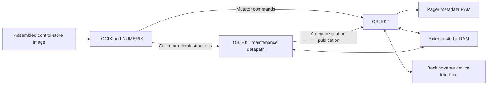

# Rekursiv: a 40-bit object machine

Status: stages 1–5 are implemented: resident OBJEKT, allocation, writeback, refill, compaction,
tracing collection, and command routines. See [README.md](README.md) for build commands and
[docs/interface.md](docs/interface.md) for the implemented interface. The
[validation record](docs/validation.md) lists the completed checks and acceptance evidence. LOGIK
implements sequencing, writable control storage, resident stacks, integer NUMERIK, autonomous OBJEKT
commands, and microcoded RAM collection with automatic allocation/refill retry. Concurrent
collection, durable persistence, a complete language ISA, and the remaining arithmetic operations
remain design work. The [recovery contract](docs/recovery.md) defines roots, relocation, retries,
and failure handling. The [command routines](docs/microprograms.md) define typed access, dictionary
lookup, and context save/restore.

## Purpose

This project implements an object machine in synthesizable SystemVerilog, starting with the OBJEKT
memory subsystem. Programs refer to objects through stable identities. OBJEKT resolves those
identities, checks field accesses, and suspends operations during object transfers. Physical
relocation does not change references between objects.

The target uses the extended 40-bit architecture as its starting point. Compatibility with
historical software, microinstruction encodings, chip pins, and clock timing is unnecessary. The
project retains useful mechanisms from Rekursiv and defines missing behavior explicitly.

The development environment follows `../simple_tta`: a Rust workspace, an assembler, Verilator
simulation through Marlin, and independent lint and synthesis checks. The current implementation
includes OBJEKT and the first LOGIK/NUMERIK processor checkpoint. A complete language runtime
remains later work.

## Terms

| Term                | Meaning                                                                                                      |
| ------------------- | ------------------------------------------------------------------------------------------------------------ |
| OBJEKT              | Object lookup, metadata, checked access, allocation, and service coordination                                |
| LOGIK               | Microsequencer, control store, and stack control subsystem                                                   |
| NUMERIK             | Integer arithmetic subsystem                                                                                 |
| Word                | A 40-bit data item                                                                                           |
| Object reference    | A tagged word that identifies a stored object                                                                |
| Compact value       | A tagged word that contains its own type code and payload                                                    |
| Pager               | Hardware that maps an object reference to resident metadata                                                  |
| Resident            | Available through a valid pager entry and its associated object memory                                       |
| RAM collector       | LOGIK microcode that traces resident objects and copies them between two semispaces                          |
| Disk processor (DP) | Auxiliary processor in the historical architecture that handles object transfers to and from backing storage |
| Mutator             | The program that allocates objects and changes their fields                                                  |
| Retirement          | The point at which a command completes and its architectural results become visible                          |

## Sources and design authority

The two local papers describe different architectures. Their examples inform this design, but their
numerical formats do not form one consistent specification. The source filenames below identify
local research files, which are excluded from version control. Neither builds nor tests require
those files.

| Source                                                                              | Relevant material                                                                             | Use in this project                                                                                                       |
| ----------------------------------------------------------------------------------- | --------------------------------------------------------------------------------------------- | ------------------------------------------------------------------------------------------------------------------------- |
| Harland and Beloff, OBJEKT (1987) (`24714.24723.pdf`)                               | Printed pp. 72–77: pager, access checks, microcode, allocation, compact values, object faults | Operational behavior and example programs                                                                                 |
| Van Hamersveld, thesis (1992) (`374655-1.pdf`)                                      | §4.2.1, §7.3, Appendix C                                                                      | Extended 40-bit representation and OBJEKT control operations                                                              |
| Thesis, chapter 6 and §7.4                                                          | Proposed parallel generational collector                                                      | Later research input                                                                                                      |
| Harland, Rekursiv book photographs (`Photos-1-001.zip`)                             | Chapter 7 and Appendix 1, selected pages                                                      | Representation, object layout, microcode examples, control-field widths, and arithmetic details                           |
| Book photographs, second batch (`Photos-1-001(1).zip`)                              | Appendix 1, pp. 174–193                                                                       | Pager operations, compact decoding, fetch control, and selected sequencer details                                         |
| Book photographs, third batch (`Photos-1-001(2).zip`)                               | Appendix 1, §§A.21–A.26; chapter 7, pp. 122–133                                               | Index and memory controls, access timing, allocation examples, numeric examples, and dictionary scanning                  |
| Book contents and clearer sequencer pages (`rekursiv-toc-186-193.zip`)              | Contents and Appendix 1, pp. 186–193                                                          | Sequencer transitions, return handling, service breaks, and operand-substitution restrictions                             |
| Book architecture, instruction examples, and stack controls (`rekursiv-more.zip`)   | Chapters 4–5, pp. 56–84; Appendix 1, pp. 144–149 and 153–163                                  | Pipeline, call frames, stack cache timing, arithmetic controls, and stack addressing                                      |
| Book condition selection and further arithmetic examples (`rekurisv-even-more.zip`) | Chapter 6, pp. 109–114; Appendix 1, pp. 150–153                                               | Condition inversion, control-stack pointer operations, barrel rotation, compact construction, and register-based examples |
| Book object-oriented languages and collection (`rekursiv-objects-gc.zip`)           | §7.10, p. 134; chapter 8, pp. 135–139                                                         | Language-level policy discussion, RAM copying collection, processor roots, and separate disk collection                   |
| Sibling `simple_tta` project                                                        | Cargo workspace, Marlin harness, RTL tests, build checks                                      | Development structure                                                                                                     |

Page references use printed page numbers, rather than PDF page indices. The local thesis ends at
Appendix C, printed page 78. Its contents lists Appendix D, but that report is absent.

The original paper describes 32-bit data paths and 160-bit microinstructions. The thesis describes
40-bit data paths and changes the collector and representation. This project fixes neither
microinstruction width nor GC policy from those historical choices.

The agreed direction is the 40-bit target, independent encodings, synchronous service stalls, and
the `simple_tta` development structure. The detailed formats and contracts below define the project
baseline. The implemented command and transfer interfaces are documented separately from later
subsystem proposals. They define an implementation baseline without claiming historical fidelity.

### Evidence from the book photographs

The first archive contains 18 photographs, including duplicate spreads and some blurred or obscured
pages. The following readable sections supplement the PDFs. Filenames identify photographs inside
the archive; page numbers identify printed pages.

| Photograph                    | Pages   | Usable evidence                                                        |
| ----------------------------- | ------- | ---------------------------------------------------------------------- |
| `IMG_20261005_214253_049.jpg` | 115     | Compact-value bit diagram; resident bodies versus complete disk images |
| `IMG_20261005_214304_229.jpg` | 116–117 | One-based component addressing; store initialization                   |
| `IMG_20261005_214314_632.jpg` | 118–119 | `CONS`, `CAR`, `CDR`; allocation faults; cached first component        |
| `IMG_20261005_214408_514.jpg` | 132–133 | Scanning and environmental-search microcode                            |
| `IMG_20261005_214018_122.jpg` | 140–141 | Control-field summary; 128-bit control store; address-register timing  |
| `IMG_20261005_214130_125.jpg` | 144–145 | ALU register file, multiplier, arithmetic conditions                   |
| `IMG_20261005_214145_527.jpg` | 146–147 | ALU control groups and destination operations                          |

Appendix 1 explicitly describes a 128-bit control-store word, including controls for external logic.
Its field summary supplies actual widths, including `ADDROPX = 3`, `ALUFUNCX = 5`, `ALUDESTX = 4`,
and `BRCH = 16`. It also gives `ALURFAX = 4`, `ALURFBX = 4`, `ALUSRCX = 5`, `CCX = 6`, and `DX = 7`.
These widths constrain the historical implementation; they do not prescribe our standalone OBJEKT
command format. The readable pages do not establish a complete mapping from symbolic operations to
numeric encodings or absolute control-word bit positions. Unclear entries remain untranscribed
rather than inferred from their order.

The second archive contains 14 photographs, including duplicate spreads. It supplies the `PAGERX`
section and the following fetch-control, register, and sequencer sections.

| Photograph in the second archive | Pages   | Usable evidence                                                                      |
| -------------------------------- | ------- | ------------------------------------------------------------------------------------ |
| `IMG_20261005_215149_983.jpg`    | 174–175 | NAM/CSMAP timing and bus widths; pager organization; `LDVR`, `LDALLOCATOR`, `SETMOD` |
| `IMG_20261005_215200_940.jpg`    | 176–177 | Historical identity format; `INIT_PAGER` and `CLRFLAGS`                              |
| `IMG_20261005_215216_997.jpg`    | 178–179 | Pager diagram; `PAGE_VR`, `PAGE_BUS`, and compact outputs                            |
| `IMG_20261005_215226_024.jpg`    | 180–181 | Resident object image; `PAGE_ALLOCATOR`, overflow, and `LDNB`                        |
| `IMG_20261005_215244_692.jpg`    | 182–183 | `LDSB`, `LDTB`, `LDAB`; compact-value diagram                                        |
| `IMG_20261005_215254_080.jpg`    | 184–185 | `LDRB`, `CLDRB`, `CSETTAG`, pager conditions; blurred fault-logic diagram            |
| `IMG_20261005_215308_873.jpg`    | 186–187 | `PGRFETCHX`, `REGX`, start of `SEQX`; small text and fault equations are blurred     |
| `IMG_20261005_215317_1CS.jpg`    | 188–189 | Sequencer operations and diagram; blurred detail                                     |
| `IMG_20261005_215325_535.jpg`    | 190–191 | More sequencer operations; blurred detail                                            |
| `IMG_20261005_215337_853.jpg`    | 192–193 | Conditional system break, return-address handling, and `SUBX` operand substitution   |

The new pages define symbolic behavior, but they still do not supply a complete numeric control-word
encoding. The third archive supplies `MEMOPX` and `IDXLDX`, which were the remaining OBJEKT source
priorities after the second batch. The fourth archive supplies clearer views of the page 186 fault
equations and the page 187 `REGX` introduction. An explicit encoding table can help with historical
packing, but the resident-object checkpoint does not depend on one.

The third archive contains 52 photographs, including long bursts of repeated memory-control pages.
The following photographs identify its main source material.

| Photograph in the third archive                              | Section or pages             | Usable evidence                                                               |
| ------------------------------------------------------------ | ---------------------------- | ----------------------------------------------------------------------------- |
| `IMG_20261005_220006_414.jpg`                                | §A.24, `MEMOPX` introduction | Object-relative memory access and separate address control                    |
| `IMG_20261005_220026_406.jpg`                                | 168                          | `MEMGET`, `MEMPUT`, `IDXGET`, and failed-read behavior                        |
| `IMG_20261005_220041_870.jpg`                                | 169                          | `IDXPUT`, modified flag, representation coherence, `MEMFLUSH`, and `LDENDMEM` |
| `IMG_20261005_220059_190.jpg`                                | 170                          | Memory capacity and software-defined microframe layout                        |
| `IMG_20261005_220123_601.jpg`                                | §A.21, `IDXLDX` introduction | 24-bit indexer and immediate index-ALU results                                |
| `IMG_20261005_220130_934.jpg`                                | Fig. 14                      | Indexer datapath diagram                                                      |
| `IMG_20261005_220141_512.jpg`, `IMG_20261005_220149_275.jpg` | 164–165                      | Index operations and conditions; some equations remain blurred                |
| `IMG_20261005_220202_859.jpg`                                | 166                          | Latched access conditions, index bus sources, argument pointer, and loop mark |
| `IMG_20261005_220251_023.jpg`                                | 122                          | `ALLOC`, `CREATE`, and explicit zero-size handling                            |
| `IMG_20261005_220338_952.jpg`, `IMG_20261005_220348_811.jpg` | 127–128                      | Raw and abstract-index access examples; optional bounds traps                 |
| `IMG_20261005_220355_249.jpg`, `IMG_20261005_220402_996.jpg` | 129–130                      | Compact construction and abstract integer constructors                        |
| `IMG_20261005_220410_819.jpg`                                | 131                          | Abstract integer addition and linear search                                   |
| `IMG_20261005_220419_539.jpg`, `IMG_20261005_220425_128.jpg` | 132–133                      | Environment lookup, wrap detection, and termination conditions                |

The fourth archive, `rekursiv-toc-186-193.zip`, contains 13 photographs. Five show the contents,
including a duplicate final contents page. Eight show individual pages 186–193. These views
supersede the earlier blurred sequencer descriptions.

| Photograph in the fourth archive                                                            | Pages    | Usable evidence                                                                             |
| ------------------------------------------------------------------------------------------- | -------- | ------------------------------------------------------------------------------------------- |
| `IMG_20261006_110350_660.jpg`, `IMG_20261006_110359_945.jpg`                                | Contents | Architecture chapter, sequencer and pipeline sections, stack instruction examples           |
| `IMG_20261006_110406_890.jpg`, `IMG_20261006_110416_448.jpg`, `IMG_20261006_110418_453.jpg` | Contents | Register-based C instructions, abstract instructions, appendix locations                    |
| `IMG_20261006_110619_025.jpg`                                                               | 186      | Fault predicates, compact bypass, fetch enable, allocator exception                         |
| `IMG_20261006_110626_863.jpg`                                                               | 187      | Index-register scan semantics, old-state reads, start of sequencer description              |
| `IMG_20261006_110635_317.jpg`                                                               | 188      | Current and next microaddresses, unconditional freeze, continuation, conditional mark jump  |
| `IMG_20261006_110640_621.jpg`                                                               | 189      | Sequencer datapath, control-stack top, dispatch address, mark, and counter                  |
| `IMG_20261006_110650_079.jpg`                                                               | 190      | Dispatch, branch-field jumps, relative jumps, conditional variants                          |
| `IMG_20261006_110655_760.jpg`                                                               | 191      | Bus-address jumps, stack returns, explicit pop obligation, start of service-break operation |
| `IMG_20261006_110702_304.jpg`                                                               | 192      | Service-break resumption, two-target branch, return-address preservation                    |
| `IMG_20261006_110708_351.jpg`                                                               | 193      | Sequencer conditions and bus source, operand substitution and its NAM-only restriction      |

Page 186 confirms that compact selection suppresses fetch and eviction work for the incoming compact
value. The fetch-enable control governs ordinary object fetching, but does not govern paging through
the allocator. New or modified collision victims still require preservation. Page 187 confirms that
the historical index register is 24 bits wide and exposes its old value during a cycle. The
implemented project indices remain 40 bits wide.

The fifth archive, `rekursiv-more.zip`, contains 46 photographs, covering one principal page per
photograph. It supplies pages 56–84, 144–149, and 153–163. All photographs were reviewed; some
overview text is blurred, but the worked examples and appendix tables provide usable detail.

| Photographs in the fifth archive, first through last                | Pages   | Usable evidence                                                                                       |
| ------------------------------------------------------------------- | ------- | ----------------------------------------------------------------------------------------------------- |
| `IMG_20261006_111357_963.jpg` through `IMG_20261006_111500_730.jpg` | 56–64   | System, LOGIK, NUMERIK, and ALU datapath diagrams                                                     |
| `IMG_20261006_111506_202.jpg` through `IMG_20261006_111528_644.jpg` | 65–68   | Microaddresses, fetch pipeline, explicit interrupt checks                                             |
| `IMG_20261006_111546_115.jpg` through `IMG_20261006_111635_782.jpg` | 69–77   | Stack initialization, literals, arithmetic, equality, comparisons, branches                           |
| `IMG_20261006_111642_370.jpg` through `IMG_20261006_111714_895.jpg` | 78–84   | Calls, returns, argument access, cached stack values, indirect access                                 |
| `IMG_20261006_111729_996.jpg` through `IMG_20261006_111756_976.jpg` | 144–149 | ALU functions, carry input, destinations, register writes, multiplier modes, abstract program counter |
| `IMG_20261006_111822_118.jpg` through `IMG_20261006_111832_446.jpg` | 153–155 | Control-stack operations, saved values, conditions, translation registers                             |
| `IMG_20261006_111838_554.jpg` through `IMG_20261006_111901_798.jpg` | 156–160 | Stack translation diagram, counter, evaluation-stack address and data controls                        |
| `IMG_20261006_111905_467.jpg` through `IMG_20261006_111917_303.jpg` | 161–163 | Compact stack writes, stack bounds checks, indexer introduction and diagram                           |

These pages supply symbolic controls and example instruction sequences, without a complete numeric
encoding table. They establish enough behavior for a project-defined processor implementation. The
unresolved details below require explicit contracts, rather than further photographs as a
prerequisite.

The sixth archive, `rekurisv-even-more.zip`, contains ten photographs. Its filename retains the
supplied spelling. All ten were reviewed; the following table identifies their principal pages.

| Photograph in the sixth archive | Pages | Usable evidence                                                                           |
| ------------------------------- | ----- | ----------------------------------------------------------------------------------------- |
| `IMG_20261006_113130_566.jpg`   | 150   | Unsigned APC stepping, compact construction, end-of-cycle AVR load                        |
| `IMG_20261006_113135_298.jpg`   | 151   | Barrel rotation and normalization, branch-field bus forms                                 |
| `IMG_20261006_113143_107.jpg`   | 152   | Complete short `CCX` description; control-stack pointer operations and address latching   |
| `IMG_20261006_113147_890.jpg`   | 153   | Control-stack data operations and end-of-cycle cache update, confirming the fifth archive |
| `IMG_20261006_113343_413.jpg`   | 109   | Register-based subtraction with register, immediate, and memory operands                  |
| `IMG_20261006_113350_561.jpg`   | 110   | Negation and increment examples                                                           |
| `IMG_20261006_113354_908.jpg`   | 111   | Decrement, signed multiplication, and logical-instruction introduction                    |
| `IMG_20261006_113407_396.jpg`   | 112   | AND and OR examples                                                                       |
| `IMG_20261006_113411_833.jpg`   | 113   | OR and XOR examples                                                                       |
| `IMG_20261006_113420_555.jpg`   | 114   | XOR and bitwise-complement examples                                                       |

Page 152 supplies the previously missing `CCX` section, but contains neither a numeric encoding
table nor a general condition-timing rule.

The seventh archive, `rekursiv-objects-gc.zip`, contains six photographs covering pages 134–139.
`IMG_20261006_115002_153.jpg` shows §7.10, which occupies page 134 only. It discusses C-like object
languages versus Smalltalk-like control flow, but supplies no class-field, method-dictionary, or
inheritance layout. Those remain runtime choices; a Smalltalk target can instead adopt its VM
specification.

The remaining photographs run from `IMG_20261006_115008_055.jpg` through
`IMG_20261006_115034_337.jpg`. Chapter 8 describes two RAM spaces, copying retained objects,
updating pager addresses, and retrying allocation after recovery. Pages 136–137 identify processor
references, evaluation-stack references, and new/modified/tag state as collection inputs. Pages
138–139 distinguish RAM retention from separate collection of the persistent disk store. The
implemented LOGIK collector adapts this algorithm to project controls and preserves processor,
compact-class, and control-store roots. The
[machine collector inventory](docs/recovery.md#machine-collector-inventory) identifies its
implementation paths and the remaining optional flush policy.

## System organization



LOGIK executes application microcode and the RAM collector on the same datapath. An allocation or
refill shortage saves the mutator context and enters the loaded collector. OBJEKT provides marks,
pager enumeration, checked copying, and atomic relocation publication. The collector restores the
context and retries the interrupted command without a host callback.

The simulator loads images and emulates external RAM and the backing-store device. Its independent
Rust models predict results for RTL tests. The native emulator also uses their instruction semantics
to execute the same microcode without Verilator. Its collector runs against a separate maintenance
datapath model, with no call to the graph-walking collector oracle. A standalone
command-driver port remains available for OBJEKT tests. Normal execution accepts one mutator command
at a time from one LOGIK/NUMERIK executor. Memory or backing-store delays stall that command until
completion.

## Word representation

The proposed layout follows the shapes in thesis figure 7.2. All bit positions and interpretations
in this section are project definitions.

| Kind             | Bits                                           | Meaning                                                       |
| ---------------- | ---------------------------------------------- | ------------------------------------------------------------- |
| Raw word         | `39 = 0`, `38:0 = payload`                     | Untyped data for opaque object bodies and internal operations |
| Object reference | `39:38 = 10`, `37 = scan`, `36:0 = identity`   | Stored object with an immutable body-scanning policy          |
| Compact value    | `39:38 = 11`, `37:32 = type`, `31:0 = payload` | Immediate value with a 6-bit type code and 32-bit payload     |

The book's diagram on page 115 instead uses five compact-type bits at `37:33`, with bit 32 fixed to
zero. Our six-bit compact type is therefore an explicit project extension, giving 64 codes instead
of 32. It is not a transcription of that historical format.

The allocator assigns identities globally from `1` through `2^37 - 1`. Identity zero is invalid. The
`scan` bit does not create a second identity namespace. The canonical reference includes that bit,
and pager comparisons use the complete reference.

The book's allocator uses 38 identity bits below its two object-format bits (pages 176 and 181). Our
37-bit identity follows the thesis extension, which reserves another bit for scanning policy. These
are distinct 40-bit formats, so the book's allocator limit does not replace our identity limit.

If `scan = 1`, the collector examines each body word for object references. If `scan = 0`, the body
contains opaque data and contributes no references. Both kinds still have a type reference that the
collector traces. The runtime cannot change the scanning policy of an existing identity.

Initial compact types are:

| Code | Type             | Canonical payload                            |
| ---- | ---------------- | -------------------------------------------- |
| 0    | `nil`            | Zero                                         |
| 1    | Boolean          | Zero or one                                  |
| 2    | Signed integer   | 32-bit two's complement                      |
| 3    | Unsigned integer | Any 32-bit value                             |
| 4–63 | Reserved         | Rejected by value constructors until defined |

All-zero bits represent a raw word, not `nil`. Allocation and reset paths must use the explicit
`nil` encoding where they initialize language values. Signed interpretation belongs to the compact
type, rather than the host container used by the simulator.

Rust stores words in `u64` and rejects values with nonzero bits above bit 39 at external boundaries.
Raw constructors, object constructors, and compact constructors use distinct APIs. Opaque bodies can
contain arbitrary 40-bit patterns because their scanning policy already excludes references.

The reference format does not provide unforgeable capabilities. Trusted microcode and service
software enforce the object interface. Normal commands cannot modify identities, scanning policy, or
physical addresses.

## Object layout and addressing

A stored object has a canonical reference, type reference, size, and body. The type reference
identifies another stored object. Boot initialization supplies the initial type graph through the
service interface.

The first target uses 24-bit word addresses and 24-bit object sizes. Object sizes count body words
and exclude metadata. Physical capacity is a configuration value bounded by the address width. An
FPGA implementation does not need to populate the entire address space.

Indices are one-based:

```text
valid_index = 1 <= index <= size
physical_address = base + (index - 1)
```

`base` addresses the first body word. The book uses a base one word before the first component, so
its address formula is `base + index` (page 116). Both conventions use one-based indices; our stored
base and address calculation deliberately differ. The hardware performs bounds and address
calculations before truncating any result. Index zero, negative indices, excessive indices, and
physical overflow produce errors. The index registers use signed 40-bit arithmetic with explicit
overflow reporting. Address calculation uses a widened intermediate. The book's indexer, including
its index register, is 24 bits wide (§A.21). Our wider signed index is a project choice that permits
rejection before address truncation.

Zero-length objects are valid. They have no accessible fields and consume no body words. Their pager
representation register contains `nil`. The book's `CREATE` example explicitly permits size zero and
skips memory writes in that case (page 122).

Metadata lives in the pager while an object is resident. The initial object memory contains bodies
without in-band headers. Backing-store records contain metadata and bodies together. The book's
object-image description on page 115 confirms this separation between resident bodies and pager
metadata. The first-body-word base convention above remains a project choice.

The first memory interface transfers whole words. Byte packing, partial writes, and external DRAM
controllers follow the core implementation.

## Pager and register state

The pager uses a direct-mapped table with a configurable power-of-two entry count. The low identity
bits select an entry. A valid bit and full-reference comparison determine a hit. If an old physical
copy remains in memory, a collision still requires service.

| Entry field | Width | Meaning                                            |
| ----------- | ----: | -------------------------------------------------- |
| `valid`     |     1 | The entry describes a resident object              |
| `VNB`       |    40 | Canonical object reference                         |
| `VSB`       |    24 | Body size in words                                 |
| `VTB`       |    40 | Type reference                                     |
| `VAB`       |    24 | Address of the first body word                     |
| `VRB`       |    40 | Cached first body word, or `nil` for an empty body |
| `new`       |     1 | The backing store has no image                     |
| `modified`  |     1 | The resident image differs from its backing image  |
| `cond`      |     1 | Runtime-defined condition state                    |

The initial table needs 172 bits per entry, before RAM packing and implementation overhead. A
1,024-entry configuration therefore needs 21.5 KiB of logical metadata storage. This is a sizing
calculation, not a synthesis result. Collector marks, copy-completion state, staged bases, and
persistence history use separate transient hardware state.

The book indexes a 64K-entry pager with the low 16 identity bits (pages 175 and 179). It stores the
upper 24 reference bits in the number table and reconstructs the low bits from the lookup address.
Our table retains the full canonical reference, which also supports smaller configurable tables
without this historical storage optimization.

Architectural state includes eight 40-bit `VR` registers, `REF`, the metadata output registers,
`IDX`, and `IDXREG`. It also includes the identity allocator, space allocator, and command status.

A successful page command replaces `REF` and all metadata output registers together. A failed page
command preserves the previous selection. The metadata output registers are a snapshot, rather than
proof of current residency. Every command that uses selected metadata revalidates `REF` against the
pager and refreshes that snapshot. If that lookup misses, the command requests service before it
uses a physical address or cached representation. An active field command pins its object until
retirement. Collection and service operations must account for that pin.

The pager accepts references from the data input, a `VR` register, and the current type or
representation register. Feedback from metadata registers supports type traversal without extra
transfers through the main data bus.

For a compact value, the pager bypasses the table and backing store. It produces zero size and
address, the decoded payload, and a type reference. A 64-entry `compact_class` table maps compact
type codes to stored class objects. Boot initialization populates the entries for supported compact
types. An unsupported or uninitialized type code returns `BAD_VALUE`. The halted bootstrap interface
changes this table while the mutator is stopped. Its populated entries belong to the GC root set.

This mapping is a project adaptation of the uniform pager interface in the original paper, printed
p. 77. That paper places a compact type code directly in the type register. The book goes further:
compact paging forms a stored type-object reference from its five-bit type code (pages 179 and 182).
It also supplies zero address and size, the low 32 payload bits, and the complete compact reference
without accessing pager tables. Our mapping gives compact and stored values the same type-reference
interface without reserving historical object numbers. A separate result-kind field still identifies
compact representations.

Field one can use `VRB` for reads. A successful write to field one updates memory, `VRB`, and the
selected representation register before retirement. The same coherence rule applies to service
updates. No other command can observe an intermediate state.

### Pager operations clarified by the book

The second photograph batch supplies the following historical behavior. These details inform project
commands without requiring the historical bus timing or privileged maintenance interface.

| Historical operation           | Defined effect                                                                                       | Project consequence                                                            |
| ------------------------------ | ---------------------------------------------------------------------------------------------------- | ------------------------------------------------------------------------------ |
| `PAGE_VR`, `PAGE_BUS`          | Select an object and latch `REF` and five output registers at the cycle's end (p. 179)               | Supports the existing selection snapshot and old-state read contract           |
| `LDSB`, `LDTB`, `LDAB`, `LDRB` | Update the selected table entry and its corresponding output register (pp. 182–184)                  | Service updates must keep selected metadata coherent                           |
| `CLDRB`                        | Update the representation only when the index is one and the access check succeeds (p. 184)          | Supports coherent field-one writes without cache changes after rejected access |
| `SETMOD`                       | Set the selected stored object's modified flag; `IDXPUT` also sets it for a memory write (p. 175)    | Ordinary successful writes set `modified` automatically                        |
| `CLRFLAGS`                     | Clear new, modified, and tag flags; compact values leave tables unchanged (p. 177)                   | Flag clearing belongs to controlled service operations                         |
| `INIT_PAGER`                   | Initialize selected table entries and output registers, with fetch disabled (p. 177)                 | Our reset instead uses explicit validity and complete-entry publication        |
| `PAGE_ALLOCATOR`               | Select the next identity, then advance the allocator; a collision can require victim saving (p. 181) | Preserve separate identity reservation, victim service, and object publication |

Table maintenance does not alter pager RAM when the selected value is compact (pages 182–184). The
historical output registers can still receive decoded compact results. Our service interface retains
its explicit stored-entry operations instead of exposing these compact-dependent maintenance side
effects.

For a collision, the book's new and modified conditions describe the existing table occupant, not
the requested identity (page 184). `IS_SQUEEZE` identifies a nonresident request whose victim is new
or modified. Fetch inhibition and victim preservation therefore remain separate decisions. Tests
must distinguish an empty slot, a clean victim, a modified victim, and a new victim.

The book preserves the upper 16 bits of its disk-image size word for software-defined information
(page 182). The pager consumes only the low 24 size bits. Those spare disk bits do not establish a
specific reference-count or collector format for this project.

## Operations and control words

The assembler starts with a typed representation of horizontal control fields. The fields retain
independent pager, index, address, memory, register, and status operations. The design does not
impose a historical 128-bit or 160-bit limit.

| Operation group | Initial operations                                                       |
| --------------- | ------------------------------------------------------------------------ |
| Registers       | Load/read `VR`, select `REF`, read metadata                              |
| Pager           | Page from data, `VR`, type, or representation                            |
| Index           | Clear, load, increment, decrement, step, save, restore, bounded scan     |
| Memory          | Checked field read and checked field write                               |
| Allocation      | Create a typed object with a specified size and scanning policy          |
| Status          | Read result kind, bounds status, service status, and errors              |
| Service         | Inspect an entry, transfer a body, publish an entry, invalidate an entry |

### Control vocabulary from the thesis

Thesis §7.3 and Appendix C already define the OBJEKT field groups and most symbolic operations. The
assembler retains those names where their behavior matches this design.

| Source field | Relevant source operations                                                         | Project treatment                                                                                   |
| ------------ | ---------------------------------------------------------------------------------- | --------------------------------------------------------------------------------------------------- |
| `Addropx`    | `loadaddr`, `allocatenew`, `allocateold`, address load and step                    | Checked address generation and allocation, with raw address access restricted to service operations |
| `Memopx`     | `idxget`, `idxput`, `memget`, `memput`, `ioget`, `ioput`                           | Checked field access first, service transfers separately, I/O deferred                              |
| `Idxldx`     | `clridx`, `ldidx`, `incidx`, `decidx`, `idxstep`, `idxnext`, `newidx`, `newidxreg` | Primary index operations and transfer between index registers                                       |
| `Regx`       | `ldreg`, `increg`, `decreg`                                                        | Secondary index register operations                                                                 |
| `Pagerx`     | `ldvr`, `page_vr`, `page_bus`, `page_allocator`, metadata and flag operations      | Object selection plus privileged entry maintenance                                                  |
| `Flagx`      | Register selection for `VR` operations                                             | Three-bit selector for the eight registers                                                          |
| `Pgrfetchx`  | `fetch`, `nopgrfetch`                                                              | Normal lookup or lookup without automatic refill                                                    |

For a nonempty object, `idxnext` wraps from the final index to one. Its initial project domain is
`0 <= IDX <= size`, so zero advances to the first field. An empty object or an index outside that
domain returns `BOUNDS_ERROR`. The wrap behavior comes from Appendix C, while the invalid-input
behavior is a project definition.

A lookup without automatic refill returns a distinct `NOT_RESIDENT` result on a miss. It preserves
the current selection and does not invoke the service processor. Compact values still complete
without table access. The thesis supplies fault inhibition, while this explicit response contract is
a project definition.

The book's `CONS` example uses `NOPGRFETCH` to suppress a spurious fetch of a newly allocated
identity (pages 118–119). It still permits service to save a new or modified collision victim. Thus
historical fetch inhibition is distinct from our resident-only probe, which never replaces an entry
or requests service. Stage 3 allocation must preserve victim writeback even when no incoming object
needs fetching.

The original paper's examples use labels and several symbolic operations on one line. The textual
microassembler will use that structure with named control fields. Token spelling, delimiters, and
binary packing remain implementation choices.

Each accepted control word reads the architectural state from before that word. Independent
operations commit together at retirement. The initial implementation has no implicit forwarding
between fields in one control word. For example, an index update and a field access use the old
index for the access. A program uses a subsequent control word to access the new index.

The book supports more tightly coupled operations: its `CAR` example combines `idx2` and `loadaddr`
on one line (page 119). Its search examples similarly combine index updates and address generation
(pages 132–133). Porting these examples requires separate project commands where one operation
depends on another's new result. Appendix 1 also states that memory operations use the starting
`memaddr`, whose new value latches at the cycle's end (page 141). These are distinct timing rules;
the book does not imply that every field observes only old state.

The third batch makes the historical pipeline explicit (§A.21 and pages 166–169):

1. The index ALU produces a new index for address generation and immediate condition evaluation.
2. The clock latches the index, prepared address, bounds result, and first-component condition.
3. The following memory operation uses that prepared address and latched conditions.

Thus an index update can prepare the next access while the current memory operation completes.
Paging another object during the memory cycle does not replace the conditions already latched for
that access. Our initial commands instead validate and access one selected object within a single
retirement transaction. They do not expose a pending historical bounds result that later commands
can accidentally reuse.

The assembler rejects conflicting operations, including multiple writers to one register. Pager
selection, field access, and allocation are mutually exclusive within one control word. This
restriction prevents two operations from competing for a pager slot during the same command. The RTL
also rejects malformed control words with `BAD_COMMAND`. The Rust reference model defines these
effects independently of the RTL state machine.

The first assembler API supplies symbolic operations and named programs. A versioned binary format
follows the first complete operation table. The binary format must define field widths, reserved
bits, immediate operands, and invalid combinations. That format is required before control-store
images become stable artifacts.

The standalone driver supplies sequencing and data literals. Its program format is a test and
development interface, not an invented substitute for LOGIK. Branching microprograms initially use a
minimal driver with explicit condition evaluation. Later LOGIK work replaces that driver while
preserving the OBJEKT command contract.

## Checked access

A field command requires a successfully selected stored object. Compact values expose their payload
through the pager result and have no addressable fields. Bounds failures return `BOUNDS_ERROR` and
produce no memory request. Reads with errors return `nil` together with the error code.

The book's `IDXGET` and `IDXPUT` use the bounds predicate `0 < idx <= vsr` (pages 168–169). A failed
historical access clears `memout` to the zero-valued undefined object. A failed write leaves memory
untouched and does not set the modified flag. A successful write places the assigned value in both
memory and `memout`, and sets `MODB`. Microcode must also select `CLDRB` to keep the cached first
component coherent. Our field-write command performs that cache update automatically, as one atomic
operation. Our explicit error response and compact `nil` replace the historical zero result.

The book also supplies unchecked `MEMGET` and `MEMPUT` for transfers and construction. Our
equivalents remain restricted to service operations. The book's `MEMFLUSH` requests disk service
rather than performing an ordinary memory write (page 169). It belongs to later persistence work,
outside the resident-only checkpoint.

Type checks are optional at the microcode level. Bounds checks remain mandatory on the normal field
interface. The minimal class convention follows the original paper, printed pp. 74–75. Field one of
a class object holds its access-type reference. That reference identifies the required class of an
abstract index. The pager's cached first word makes this lookup inexpensive.

Typed access first obtains the target object's class, then that class's access type, then the index
object's class and payload. The microprogram compares the two type references before it accesses a
field. Compact and stored indices use the same class reference through `compact_class`. The
microprogram retains the target reference across these pager selections. Bounds apply after
extraction of the numeric index.

Our class convention uses `nil` as the access type for classes that forbid typed indexing. Class
objects must contain that first field. The remaining class fields, method dictionaries, and
inheritance layout belong to the language runtime. Book §§7.3–7.9 give construction, access,
numeric, and dictionary-search examples without fixing that complete runtime layout. Section 7.10
discusses alternative language models, including methods and inheritance (page 134). These runtime
decisions are not prerequisites for the resident OBJEKT implementation.

The initial hardware exposes the required metadata and explicit type-match condition. The stage 5
command driver performs multi-step type traversal, including automatic refill after pager
collisions. Its stored-index convention uses one opaque word containing a signed 40-bit integer.
This convention does not define general wide-number arithmetic. A later datapath can accelerate that
traversal without changing its result. An enabled type check that fails returns `TYPE_ERROR` without
a memory access.

A failed command preserves mutator-visible state. Memory writes require successful validation of all
control fields before the hardware sends the write request. The object receives its `modified` flag
only after a successful write. The backing service serializes its accesses with mutator writes.

## Numeric results and compact overflow

The original paper, printed p. 77, defines an overflow path through its `AVR` result register. If a
result exceeds its 28-bit compact payload, the processor suspends execution while an auxiliary
processor creates a stored object. Execution resumes with that object's reference as the result.
This describes a representation overflow within the early machine's arithmetic width. It does not
specify arbitrary-precision arithmetic.

The project adopts the same construction policy for its 32-bit compact payloads. A representable
value becomes compact. An exact supported result that exceeds the compact range becomes a stored
numeric object through the service interface. Its class matches the corresponding compact numeric
class. Retirement waits for successful construction, and allocation failure returns an error without
publishing a partial result.

The arithmetic path must retain the exact result before it requests construction. Boxing cannot
recover bits that the ALU already discarded. Until a wider result format exists, arithmetic beyond
the supported exact width returns `NUMERIC_OVERFLOW` without silent truncation. The limb layout,
signedness rules, and arithmetic operations for stored wide numbers remain open. Book §7.8 supplies
`MK_INTEGER`, `MK_SMALL_INTEGER`, and `ADD_INTEGER` examples (pages 130–131). These provide future
microprogram workloads, but do not resolve the stored wide-number representation.

## Requests, stalls, and service completion

The command interface uses `valid` and `ready` signals. Acceptance occurs on a rising clock edge
where both signals are high. The response interface uses the same handshake. OBJEKT holds response
data stable until the consumer accepts it.

Only one command can remain outstanding. The hardware retains its operands and proposed state
changes during stalls. It must not repeat allocation, index updates, or memory writes during those
stalls. Every accepted command produces exactly one success or error response, unless system reset
aborts execution.

The object-memory interface also uses request and completion handshakes. An accepted write becomes
visible once, at successful memory completion. The initial memory model guarantees that a reported
write error has no write effect. A future physical-memory adapter must provide the same contract or
define a terminal machine error.

Resident-only probes return `NOT_RESIDENT` immediately on a lookup miss. The stage 3 Fetch command
automatically refills a missing object from the backing store. The halted initialization interface
remains separate from the streaming backing-store channel.

Allocation and a Fetch miss follow this sequence:

1. The RTL retains the operands and obtains incoming metadata for a Fetch miss.
2. The allocator checks capacity and reserves a fresh body range, plus an identity for allocation.
3. If the victim is new or modified, the RTL streams its complete body to an atomic backing-store
   save.
4. The RTL initializes the new body or copies the incoming stored body into the fresh range.
5. After the body succeeds, the RTL publishes complete pager metadata and selects the result on one
   clock edge.
6. OBJEKT returns one response and holds it until acceptance.

The victim remains valid throughout transfer. This stronger publication rule preserves the previous
mapping even if an incoming transfer fails. The service must reject a reference whose scan flag
differs from its canonical record. An unknown identity returns `INVALID_REFERENCE`, and a backing
transfer failure returns `SERVICE_ERROR`. A memory-word transfer failure returns `MEMORY_ERROR`.

A failed transfer can consume an identity reservation and physical space. Previously completed
unpublished body writes and committed victim saves can remain. The failure cannot change any
published object value, selected snapshot, or pager entry. The next allocation never reuses a
consumed identity or reserved body range.

The streaming backing-store channel remains available while the mutator waits. Its responder cannot
depend on accepting another mutator command or a halted initialization command. This restriction
prevents a circular wait between refill and normal access. Resident metadata operations continue to
return `NOT_RESIDENT` for stale mappings. The caller uses Fetch to restore the selection before
retrying those operations.

Reset clears command state, responses, pins, and pager validity. A cold reset also clears volatile
allocator state. The complete simulator reset cancels its pending memory and service transactions.
Warm restart with external transactions is deferred until the system defines transaction epochs or
an equivalent drain protocol.

## Allocation and space management

Object identities and physical body space use separate allocators. The identity allocator is
monotonic and never wraps. Exhaustion returns `IDENTITY_EXHAUSTED`. The initial system never reuses
an identity, even after collection.

The body allocator uses a bump pointer over a configured region. Allocation checks the requested
size, address overflow, and available capacity before publication. The cursor and capacity
calculations include an extra bit to represent the position beyond the final physical word. An
exhausted region requests collection or returns `OUT_OF_SPACE`. The allocator does not silently wrap
or overwrite existing bodies.

An allocation command resolves any pager collision before it publishes the new object. For a scanned
body, it initializes every field to `nil`. For an opaque body, it initializes every field to zero.
Metadata publication and the returned reference follow successful body initialization.

Allocation cost therefore grows with body size. The design makes no constant-time claim for
initialized objects. A service error can consume an identity reservation, but it cannot expose an
incomplete object. Failed body reservations become reclaimable space and never overlap live objects.

Eviction removes the resident mapping and leaves its former body space reclaimable. The initial
allocator does not reuse individual holes. A coordinated compaction recovers those holes and resets
the bump pointer. Refill and ordinary allocation use the same space accounting.

## Collection and persistence

Stable identities permit relocation without rewriting object fields. They do not remove the need for
root discovery, metadata coherence, or mutation coordination. The thesis's concurrent generational
collector remains a later design task.

The RAM collector runs as 68 LOGIK microinstructions assembled into the control store. OBJEKT
reserves two equal semispaces in external RAM; the lower half is initially active. Allocation and
refill exhaustion enter the collector with the failed request and processor context preserved in
hardware. The mutator stacks and fetch pipeline remain frozen while collector instructions use
NUMERIK for loop state.

The microcode marks machine roots, traces resident class and scanned-body edges, and retains unsaved
persistent objects and their descendants. Successful saves also protect NEW RAM objects named by
backing records, even after the saved parent leaves the pager. Repeated pager passes replace the
book's recursive traversal and require no heap work stack. Nonresident references are ignored during
RAM tracing; no backing records are fetched or deleted. Unreachable new objects and unretained clean
RAM copies lose their pager mappings.

The collector stages destination addresses and copies retained bodies through the normal external
RAM channel. OBJEKT publishes the new pager bases and allocation cursor only after every copy
succeeds and the pending request fits. Then LOGIK restores its saved context and retries the
original instruction. A memory error or full retained space leaves the source heap authoritative and
halts at the interrupted microaddress. The optional disk-flush fallback is not implemented.

The [recovery contract](docs/recovery.md) defines roots, controls, ownership, semispace bounds,
retry, and failure behavior. The older Rust whole-store collector remains a test utility for
standalone OBJEKT exercises. It is not part of this machine execution path.

The first backing store is an in-memory Rust map keyed by identity. Object transfers preserve the
exact 40-bit body words. The simulator can then add explicit save and restore of a complete
object-store image. Such an image includes the identity high-water mark, roots, type mappings, and a
format version.

Transparent object transfer does not imply crash consistency. A durable store needs a separate
commit protocol for object records, roots, and allocator state. Journaling, recovery after power
loss, concurrent collection, and background writeback remain separate milestones. No initial test
result can establish those properties.

### Generational collector supplied by the thesis

The thesis provides a concrete later collector, rather than only a general suggestion. Sections
6.1.5–6.3, Appendix A, and Appendix B describe these mechanisms:

| Mechanism       | Source proposal                                                                                |
| --------------- | ---------------------------------------------------------------------------------------------- |
| Spaces          | `NewSpace`, `PastSurvivorSpace`, `FutureSurvivorSpace`, and `OldArea`                          |
| Placement       | Allocate new objects in `NewSpace`, and load disk objects into `OldArea`                       |
| Promotion       | Count survived scavenges and promote at a configurable tenure threshold                        |
| Traversal       | Start from processor roots and retain discovered scanned references in a deduplicated worklist |
| Disk traversal  | Stream nonresident bodies through the collector without installing them in the mutator pager   |
| Relocation      | Copy live young objects, update their pager addresses, then exchange survivor-space roles      |
| Exclusion       | Lock objects during writes or relocation, and lock shared allocation cursors                   |
| New allocations | Save the allocation cursor at cycle start and preserve later allocations during cleanup        |

The selected algorithm scans the reachable graph, including old objects, instead of maintaining the
conventional old-to-young remembered set. Its generational placement therefore does not imply that
tracing visits only the young generation. The thesis uses CAM structures for duplicate detection and
address searches. Section 7.5 explicitly permits alternative structures and calls for asynchronous
disk handshakes.

These details define a useful future collector candidate. A future machine collector could add a
worklist and streamed traversal before attempting concurrent execution. Hardware CAMs and concurrent
execution are unnecessary for that first implementation.

The concurrency argument still needs independent work. For example, the collector can scan rooted
object A before rooted object B. The mutator can then copy B's sole reference to X into A and remove
it from B. If the collector now scans B, it can miss X despite X remaining reachable through A.
Per-object exclusion during writes and relocation does not prevent this sequence. A barrier or
another proven mutation protocol must close this gap before concurrent reclamation is enabled.

The thesis also stores survivor counts in redundant low bits of `VNB` for its particular pager size.
Our pager compares canonical full references and supports different capacities. Any future survivor
count therefore uses explicit metadata unless a separate tag-storage encoding receives its own proof
and tests.

## Processor source baseline

Thesis §§4.2.2–4.2.4 establish the main organization of LOGIK and NUMERIK. Those structural choices
do not need to remain open.

LOGIK has separate control and evaluation stacks. The control stack retains microcode and
abstract-code return positions, frame pointers, and saved values. It supports nested and recursive
microprogram calls. The evaluation stack retains operands and intermediate values. The project
evaluation stack holds 40-bit values and supplies roots to the collector. Its 24-bit control stack
holds addresses and cannot contain complete tagged references.

The thesis chooses a fully resident evaluation stack for its extended design in §6.2.2. The
implemented stacks are resident, with configurable capacities and explicit bounds errors. The book
now supplies a concrete example frame layout and historical pointer widths. The processor interface
fixes the current pointer widths and stack behavior; stack paging remains later work.

The abstract instruction path uses `NAM` for code and `CSMAP` to map opcodes to control-store entry
addresses. The project retains a writable control store. The thesis's suggestion to fix the
instruction set in §5 is not part of this project. The historical pipeline schedule does not
constrain our stalls or cycle counts.

The book identifies a 10-bit opcode, a 30-bit encoded operand, and a 24-bit decoded operand bus
(page 174). `READCSMAP&NAM` reads the old opcode register while loading its next value. The
implemented fetch path preserves this dependency. The `SUBX` section identifies operand fields
`SRC = 23:20`, `DST = 27:24`, and a branch value at `15:0` (page 193). Those positions describe the
abstract operand, not the packed control word. They support operand-driven ALU register selection
and branch substitution without establishing a complete language instruction set. The sequencer also
retains a return address that microcode must preserve on the control stack before another jump
overwrites it (page 192).

NUMERIK starts from the documented 32-bit ALU, multiplier, and barrel shifter. The book specifies
sixteen 32-bit ALU registers and a multiplier with two 32-bit operands and a 64-bit result (pages
144–145). The multiplier retains its result in two registers and exposes one word at a time. Signed
and unsigned operands are supported. Documented conditions include zero, sign, carry, overflow, sign
XOR overflow, and a zero test on the multiplier's high word. These provide the arithmetic baseline;
original single-cycle multiplication is not a project timing requirement. Results can feed the
evaluation stack as raw values or tagged compact values. Pages 146–149 now supply symbolic
arithmetic controls, including division-related steps and carry-input rules. The processor interface
specifies the implemented encodings, flag timing, and arithmetic subset. Division and the remaining
historical arithmetic controls are not implemented. Smalltalk-80 supplies an example instruction-set
target in the thesis, but neither PDF supplies its complete executable microcode.

### Sequencer behavior resolved by the fourth archive

The following describes historical symbolic behavior, not an implemented stage 6 interface. The
clearer pages establish register transitions without supplying numeric `SEQX` encodings.

`cua` holds the current microinstruction address. `upc` holds the sequential successor. `upcor`,
also printed as `upc'or`, retains a return address. `ucar` holds the result of a previous opcode
lookup through CSMAP. `mark` supplies another branch target, and `cstkr` exposes the control-stack
top. `D` is the selected bus value, `BRCH` is a control-word field, and `cc` is the selected
condition.

For a taken ordinary jump, the target becomes `cua` and its successor becomes `upc`. The old `upc`
is captured in `upcor`. Sequential continuation preserves `upcor`. These rules make a jump usable as
a call, but do not automatically push a return address.

| Operation     | Target or effect                                                                                       | Source page |
| ------------- | ------------------------------------------------------------------------------------------------------ | ----------- |
| `NOSEQX`      | Hold `cua`, `upc`, and `upcor`. This freeze must not depend on a condition.                            | 188         |
| `CONT`        | Select old `upc` as the next current address and increment `upc`.                                      | 188         |
| `CJM`         | Jump to `mark` when `cc` is true. Otherwise continue.                                                  | 188         |
| `JV`, `CJV`   | Dispatch through `ucar`, unconditionally or when `cc` is true.                                         | 190         |
| `JBR`, `CJBR` | Jump through `BRCH`, unconditionally or when `cc` is true.                                             | 190         |
| `JR`, `CJR`   | Jump to old `cua + D`, unconditionally or when `cc` is true.                                           | 190–191     |
| `JD`, `CJD`   | Jump through `D`, unconditionally or when `cc` is true.                                                | 191         |
| `RET`, `CRET` | Jump through `cstkr`, unconditionally or when `cc` is true. The stack pop is separate.                 | 191         |
| `CSEQBRK`     | Continue the address sequence and, when `cc` is true, yield control to the selected service processor. | 191–192     |
| `JRP`         | Always jump. Choose `BRCH` for true `cc`, or `mark` for false `cc`.                                    | 192         |
| `CJUPC'OR`    | Return through the saved `upcor` when `cc` is true. Otherwise continue.                                | 192         |

Untaken conditional dispatches, ordinary jumps, and stack returns act as `CONT`. Relative offsets
use the current address, not its successor. A zero relative offset therefore selects the current
microinstruction again. This is a deliberate loop, distinct from freezing the sequencer for service.

`RET` does not pop the control stack. Microcode must select the stack operation that removes the
return address. A callee preserves `upcor` with `PUSHUPC'OR` before another jump overwrites it. A
short routine without an intervening jump can return directly through `CJUPC'OR`. The processor
tests cover nested calls and the separate return/pop operations.

`CSEQBRK` selects the service processor using the low four `BRCH` bits. Code zero selects the disk
processor. The historical operation halts the clock and relinquishes system control. Service can
hold the sequencer with `NOSEQX`, then resume at the successor as if `CONT` had completed. The break
preserves `upcor`. The project retains synchronous service handshakes instead of adopting historical
clock stopping. Its implementation must prevent command reissue while preserving the intended resume
address.

Page 193 adds an important operand-substitution restriction. `SUBX` uses the pipelined `namarg`
currently available to the D bus. It can substitute `SRC[23:20]` or `DST[27:24]` into an ALU
register selector, and `namarg[15:0]` into `BRCH`. The book restricts this mechanism to instructions
fetched from NAM. It does not apply to bus-supplied dispatch through `LDCSMAPAR`. This distinction
needs an explicit operand-latching rule in the project decoder. The remaining substitution
combinations continue beyond page 193.

Some printed details still require an explicit project choice. Page 188 describes a 16-bit address
path but states a maximum of 32K control words. Page 65 instead describes a 64K maximum, while the
system diagram on page 56 labels a 16K control store. These references do not establish a consistent
hardware capacity limit for the project. Page 193 prints `UPCOFLO` as `upcalu > 2^16`, which does
not resolve the exact overflow boundary or wrap policy. It lists `LASTCC` without defining its
update timing on this page. The page 192 `CJUPC'OR` equation includes a return-register assignment
that its CONT-like false-path prose does not clearly explain. The project must define that corner
case rather than infer it from typography.

### Stack, call, and arithmetic behavior resolved by the fifth archive

These are historical mechanisms and software conventions, not additions to the implemented stage 5
interface. The examples describe the book's stack-based NIL instruction set. They provide a usable
first calling convention without prescribing a language runtime's class or method layout.

#### Stack addressing and cached values

The evaluation stack stores 40-bit words, including object references and raw binary values (page
160). `ESTKR` caches the value most recently read or written at the selected stack address. That
address can differ from the logical top of the stack. Changing a pointer or address alone does not
refresh `ESTKR` (pages 71–74 and 81–82). Microcode must restore both the top address and its cached
value before an instruction that assumes them.

`LDESTK` writes the D bus and updates `ESTKR`; `READESTK` reads the selected address into `ESTKR`.
`NEWESTKY` writes the selected arithmetic result; `NEWESTKBRCH` writes the branch-field value.
`NEWESTKOBJ` constructs a compact object and updates the stack cache, independently of an optional
AVR load (pages 160–161). Its historical layout has payload bits 31:0, zero at bit 32, `FLAGX` at
37:33, and set compact/object bits 38 and 39. Our existing word representation remains the project
authority. Transfers of general values must preserve all 40 bits; the examples use a value register
when an ALU register would truncate them (page 84).

The detailed control-stack description specifies 24-bit entries and a cached `CSTKR` (page 153). The
overview diagram labels both stacks as 40-bit memories (page 56). The project must explicitly choose
its control-stack width and root representation instead of treating those descriptions as
interchangeable.

`LDCSTK`, `PUSHFP`, `PUSHAP`, `PUSHSP`, `PUSHAPC`, and `PUSHUPC'OR` write the selected control-stack
address and update `CSTKR`. The `PUSH` names do not imply a pointer increment; pointer control is
separate (pages 153–154). `INCCSTK` and `DECCSTK` change the cached word and write it back, rather
than moving the stack pointer. `READCSTK` refreshes the cache from the selected address. This
distinction matters when implementing nested calls and the sequencer's separate return/pop
operations.

The historical abstract program counter and logical stack address paths are 24 bits wide (pages 149
and 153–160). `SP` tracks the evaluation-stack top, while `ESP` selects the logical address used for
a particular access. Both stacks translate logical addresses using a signed offset:
`physical_address = logical_address + offset`. The offset is the physical segment base minus its
logical base. Address translation and segment checks operate together when an address changes (pages
155–156 and 162). The printed checks use `address - logical_base < 0` and
`address - logical_base > stksize`. The prose calls `stksize` a size, so the inclusive upper
boundary remains ambiguous. Project capacity checks must define the last valid slot explicitly and
must reject an invalid access before a memory write.

#### Worked calling convention

Stack pointers identify the current top; a push first advances the pointer (pages 69–70). Before
`CALL n`, the evaluation stack contains the function entry address followed by its arguments. The
callee's argument pointer identifies that entry-address slot; argument one is at `AP + 1`. The
example control frame has this order (pages 78–80):

| Position, bottom to top | Saved value                                                                                          |
| ----------------------- | ---------------------------------------------------------------------------------------------------- |
| First                   | Zero marker for an abstract-code caller; a microcode return address can occupy this position instead |
| Second                  | Abstract return program counter                                                                      |
| Third, frame top        | Caller argument pointer                                                                              |

`ENT n` reserves local slots above the arguments. Return restores the caller's argument pointer and
program counter, and replaces the function-entry slot with the result. Arguments and locals are
thereby removed from the active evaluation stack. The marker selects abstract-code dispatch or a
return to microcode (pages 80–81). This is distinct from stage 5's object-backed context frame;
adopting it needs a separate LOGIK frame contract.

Argument loads and stores temporarily select `AP + argument_number` (pages 81–82). A store also
changes the cached stack value, so the examples explicitly reread the true top afterward. Acceptance
tests should cover nested calls, local slots, result placement, argument stores, and tagged values
that differ only above bit 31.

#### Pipeline and comparison rules

The fetch sequence increments APC, reads NAM into the opcode register, reads CSMAP into `ucar`, and
dispatches through `JV` (pages 66–68). Overlapping those steps primes the following instruction;
branches and calls explicitly refill the pipeline. Interrupt checks can replace unconditional
instruction dispatch with conditional dispatch and a service path. These are microcoded checks, not
evidence for automatic interruption at every microinstruction. The project can preserve these
dependencies with synchronous handshakes without reproducing the historical cycle count.

Full object equality uses the 40-bit symbol comparator: `LDSYM` followed by `IS_SYM` (page 75). The
32-bit ALU zero flag alone cannot establish object equality. Signed ordering uses corrected sign,
`ALU_CS = ALU_S XOR ALU_O` (pages 75–76). Overflow trapping is explicit in the example microcode
rather than an unconditional arithmetic side effect.

#### Arithmetic controls

The clearer tables distinguish ALU result `F`, destination output `Y`, and the separate `Q` register
(pages 146–148). `ALUDESTX` selects destination and shift behavior; `ALURFWX` separately enables
writing `Y` to register B. Basic source combinations select from register-file ports, D, the barrel
shifter, `ESTKR`, and branch-field forms (page 149). The listed combinations do not imply an
unrestricted crossbar.

| Control or condition               | Documented behavior                                 | Pages   |
| ---------------------------------- | --------------------------------------------------- | ------- |
| `CIN`, `NOCIN`, `CINZ`             | Carry input is one, zero, or the ALU zero condition | 145–146 |
| `ADD`                              | `F = R + S + CIN`                                   | 148     |
| `SUBR`                             | `F = S - R - 1 + CIN`                               | 148     |
| `SUB`                              | `F = R - S - 1 + CIN`                               | 148     |
| `ALU_Z`, `ALU_S`, `ALU_C`, `ALU_O` | Zero, sign, carry, and signed overflow conditions   | 145     |
| `ALU_CS`                           | Sign XOR signed overflow                            | 145     |
| `MULTNL`                           | Multiplier high word is zero                        | 145     |

Ordinary subtraction therefore requires carry input one. The symbolic tables also cover logical
functions, shifts, Q operations, multiply steps, division-related steps, and BCD operations. They do
not provide a complete executable division algorithm or numeric field encodings. Multiplier modes
distinguish unsigned, signed, and mixed-signedness operands, with optional rounding (pages 145 and
147). The exact rounding rule and special-function algorithms still need project definitions if
included. Stage 6 can start with a specified integer subset and explicit flag timing.

The new stack rules also expose a useful distinction for the processor contract. Cached stack data
stays available during the current cycle, while address translation can use a newly calculated
pointer. One blanket rule that every consumer sees only old state would lose this distinction. The
model and RTL must agree on source sampling, address generation, flag selection, and retirement
during an OBJEKT stall.

### Condition selection and additional controls from the sixth archive

Section A.14, `CCX`, occupies one short paragraph on page 152. It explicitly omits a complete
condition list and refers readers to the fields whose logic generates each condition. Every
condition can be inverted. Some conditions combine into hard errors or page faults that halt the
historical machine and interrupt its host. This section supplies no selector values, latch schedule,
or `LASTCC` update rule. The earlier suggestion to inspect pages 150–152 located `CCX`, but did not
establish the hoped-for timing or encoding evidence. `CCMODEX` and `CLOCKX` occur in the field
summary; these pages contain no separate descriptions of them.

Section A.15, `CSPX`, on the same page supplies the missing control-stack pointer controls:

| Operation | Pointer effect               |
| --------- | ---------------------------- |
| `NOCSPX`  | Hold the pointer             |
| `LDCSP`   | Load the pointer from D      |
| `INCCSP`  | Increment the pointer by one |
| `DECCSP`  | Decrement the pointer by one |

The pointer and physical address register are 24 bits wide. When the pointer changes, translation
computes its physical address and latches `CSTKAR` at the end of that cycle. The translated address
uses the updated pointer plus the control-stack offset. Page 153 separately confirms that stack
writes update `CSTKR` at the end of their cycle. These rules constrain pointer and data sequencing;
they do not define when every arithmetic condition becomes available. The printed `CSPOFLO`
inequality uses `csp > 2^24`, leaving the same boundary ambiguity found in other overflow
descriptions.

Page 150 defines `STEPAPC` as addition of an unsigned 24-bit D-bus offset. It also confirms the
compact-construction layout described above and an end-of-cycle `AVR` load. The constructed value
can feed `NEWESTKOBJ` independently of whether `AVR` is loaded.

Page 151 defines the barrel operation as a 32-bit left rotation of D. `ROTATE` uses the low five
bits of `ESTKR` as the distance. `NORMALIZE` selects a priority-derived distance from the stack
value, which must also be selected onto D. Normalization still rotates; microcode must generate a
mask to exclude the sign bit from the normalized result. `PRIORITY` exposes the normalization
distance as a bus source. The page does not fully define priority behavior for every input, so that
behavior still needs a project contract if implemented.

The same page confirms four branch-field bus forms: low 16 bits, high 16 bits, sign extension to 32
bits, and object-bit marking. It also reiterates that operand substitution can supply `BRCH` from
`namarg`.

Pages 109–114 supply worked register-based arithmetic and logical sequences, rather than binary
instruction encodings. They corroborate carry-one subtraction, temporary Q use, explicit
register-write enable, stack-cache restoration, and reading a retained multiplier result. The
complement example uses XOR with sign-extended minus one. These are useful processor test workloads;
they do not fix flag sampling, a complete division algorithm, or numeric control-word packing.

### Processor implementation checkpoint

The first stage 6 implementation now executes project microinstructions through synthesizable LOGIK
and NUMERIK. The [processor interface](docs/interface.md#processor-checkpoint-logik-and-numerik)
defines its encoding, flags, stacks, fetch timing, and faults. The module split separates storage,
sequencing, stacks, arithmetic, and retirement control. A shared retirement signal prevents partial
local updates during OBJEKT stalls. An independent Rust processor model checks each retirement and
all processor registers and stack slots. The `processor` example allocates, evicts, and refills
objects under RTL control. Full language microcode, operand substitution, remaining arithmetic
operations, and stack paging remain stage 6 follow-up work.

### Book sections identified by the contents

The fifth archive supplies the architecture, pipeline, and stack-instruction sections previously
identified only through the contents. The following table distinguishes reviewed material from
remaining navigation leads.

| Section                                    | Printed pages                  | Coverage and use                                                                         |
| ------------------------------------------ | ------------------------------ | ---------------------------------------------------------------------------------------- |
| §4.2, LOGIK connectivity and functionality | Starts at 59                   | Reviewed: stack organization and interfaces                                              |
| §4.5, microcode sequencer                  | Starts at 65                   | Reviewed: sequencer overview and address-capacity discrepancy                            |
| §4.6, pipeline and interrupts              | Starts at 66, interrupts at 68 | Reviewed: fetch dependencies and explicit interrupt checks                               |
| §5.7, function calling                     | Starts at 78                   | Reviewed: executable call/return and stack examples                                      |
| §5.8, accessing function arguments         | Starts at 81                   | Reviewed: argument access and stack-cache restoration                                    |
| §6.6, C functions                          | Starts at 104                  | Unread lead: alternative calling conventions for a register-based instruction set        |
| §7.10, object-oriented languages           | 134 only                       | Reviewed: language approaches, without class layouts or method/inheritance specification |

Control/evaluation stack data operations, control-stack pointer operations, basic ALU controls, and
the short `CCX` section are now covered. The sixth archive closes the page 150–152 gap. Further
`SUBX` combinations follow page 193. The processor interface defines project encodings and condition
timing for the implemented subset. Further historical scans are not prerequisites for work within
that contract.

## Rust workspace and RTL structure

```text
Cargo.toml
Cargo.lock
README.md
DESIGN.md
docs/interface.md    # Implemented fields, operations, handshakes, and errors
crates/
  rekursiv-asm/       # Words, symbolic control fields, encoding, listings
  rekursiv-model/     # Architectural semantics shared by RTL tests and emulator
  rekursiv-devices/   # External peripherals shared by both executors
  rekursiv-emulator/  # Native microcode executor, headless CLI, window/input
  rekursiv-smalltalk/ # Offline image importer, runtime assembly, image tests
  rekursiv-sim/       # Marlin harness, command driver, CLI, host initialization
    src/programs.rs  # Named executable examples
    src/microprograms.rs # Typed access, dictionary lookup, and context frames
    tests/           # Differential and cycle-level protocol tests
rtl/objekt.sv        # Resident operations and complete-entry publication
rtl/objekt_transfer.sv # Allocators, initialization, save, and refill engine
rtl/objekt_gc.sv     # Collector marks, physical copies, staged relocation
rtl/logik.sv         # Processor integration and retirement
rtl/logik_store.sv   # Control store, NAM, and opcode map
rtl/logik_stacks.sv  # Resident stacks and cached values
rtl/logik_sequencer.sv # Conditions and microaddresses
rtl/numerik.sv       # Arithmetic registers, flags, Q, product
rtl/numerik_alu.sv   # Combinational integer operations
rtl/*.svh           # Named controls and packed structures
objekt_tb.sv         # 16-entry pager and 512-word simulation configuration
scripts/            # Complete checks, lint, and generic synthesis
.github/workflows/ci.yml
```

This tree describes stages 1–5 and the first stage 6 processor checkpoint. The assembler reads
`microcode/ram-collector.uc` through its lexer and parser; `ram_gc.rs` independently specifies RAM
retention for tests. The older model and simulator `recovery.rs` files support host-driven OBJEKT
regression tests. Separate pager/index modules, `simtop.sv`, and an FPGA core description remain
future files. The resident operations remain together in `objekt.sv`, with transfer sequencing in
`objekt_transfer.sv`.

The assembler has no simulator dependency. Its [text format](docs/assembler.md) supports standalone
microcode files; the processor examples and collector use that format. The model depends on
architectural types, but never on Verilator or RTL internals. The simulator depends on the assembler
and model. The workspace adds language compiler crates only after their target operations exist.

Shared types prevent accidental width disagreements. Independent transition logic prevents the
reference model from merely repeating the RTL algorithm. Encoding tests use explicit bit patterns so
shared definitions cannot hide encoder errors.

Marlin provides Rust bindings to the Verilator model, following `simple_tta`. The harness supplies
request and memory delays, response backpressure, fault injection, completed-command records, and
VCD traces. The backing-store adapter has independent request and completion delays and atomic
object-record publication. File paths resolve from crate or workspace locations, rather than the
caller's working directory.

Development commands are:

```text
cargo test --locked -p rekursiv-asm -p rekursiv-model
cargo test --locked -p rekursiv-sim
cargo run --locked -p rekursiv-sim -- --example field-access --listing --trace-file objekt.vcd
scripts/check.sh
```

Rust formatting, Verilator lint, and Yosys synthesis form separate build checks. The target
SystemVerilog subset must compile under both Verilator and Yosys. Sequential logic uses nonblocking
assignments. The implementation uses explicit ports and no simulator-only RTL constructs. The
current combinational pager synthesizes to registers and logic; FPGA RAM packing requires later
work.

A future FuseSoC description must list the actual modules and valid targets. The existing
`simple_tta` file contains stale references, so it cannot serve as a direct copy. The FPGA part, RAM
packing, and external memory adapter remain deployment choices.

## Validation

The Rust model defines results at command retirement. RTL comparisons use those retirement events
and committed memory effects, rather than assuming identical internal cycle counts. Separate
protocol tests check cycle-level behavior under backpressure.

| Area           | Required evidence                                                                      |
| -------------- | -------------------------------------------------------------------------------------- |
| Representation | Exact bit patterns, canonical values, signed limits, rejection of invalid identities   |
| Pager          | Hit, miss, collision, empty entry, compact bypass, canonical-tag mismatch              |
| Bounds         | Zero, negative, last valid, first invalid, empty object, address overflow              |
| Writes         | No effect on failed checks, coherent first-word cache, correct modified state          |
| Allocation     | Initialization, collision, capacity limit, identity exhaustion, no partial publication |
| Protocol       | Stable stalled requests, stable responses, one retirement, no duplicate writes         |
| Service        | Dirty/new victim save, refill, invalid reference, transfer failure, delayed completion |
| Collection     | Root survival, cycle reclamation, opaque data, relocation, stale-record rejection      |
| Tooling        | Assembler round trips, fixed encoding vectors, example programs, reproducible traces   |

The resident property tests generate command sequences, object bodies, metadata flags, scan tags,
and independent memory and response delays. They use the fixed 16-entry wrapper and force
replacement through colliding identities. Small tables force collisions frequently. The harness
compares the RTL against the reference model after each retirement. Seeds and the generated program
accompany every failing case.

Performance reports separate command counts, RTL cycles, service transfers, and synthesis resources.
Historical timings do not predict FPGA performance. Resource and clock-frequency claims require
measured results for a named configuration and toolchain.

## Scope without historical encodings

The first implemented checkpoint covers stages 1 and 2: a working resident-object OBJEKT subsystem.
It does not depend on the precise encodings in the book's Objective chipset control-word appendix.
Historical compatibility remains unnecessary. The partial book photographs refine the source
evidence without expanding this checkpoint.

### Deliverables

| Area                | Included in this scope                                                                                           |
| ------------------- | ---------------------------------------------------------------------------------------------------------------- |
| Workspace           | The three Rust crates, Cargo build commands, and local artifact directories                                      |
| Architectural types | The proposed 40-bit formats, checked constructors, metadata, indices, and command results                        |
| Reference model     | Independent semantics for the supported resident-object commands                                                 |
| Assembler           | Typed symbolic control words, provisional operation numbers, and readable command listings                       |
| RTL                 | Pager, registers, index operations, compact decoding, checked reads and writes, and command retirement           |
| Initialization      | A service path to install body words, complete metadata, and compact-class mappings while the mutator is stopped |
| Simulator           | Marlin/Verilator harness, configurable memory latency, response backpressure, and VCD output                     |
| Examples            | Named Rust-built programs for field access, compact values, index scanning, and rejected operations              |
| Build checks        | Rust tests and formatting, Verilator lint, and Yosys synthesis of the OBJEKT top                                 |

The simulator CLI selects a named example and can write a waveform trace. The initial scope omitted
a text assembler and processor wrapper; both are now implemented. FPGA board deployment remains
separate work. The broader workspace tree describes later files as well as this initial subset.

### Encoding and timing boundary

The first RTL wrapper exposes separate control fields with explicit provisional operation numbers.
One conversion layer maps symbolic commands onto those fields. Model tests and example programs use
symbolic commands rather than numeric literals. Encoding tests alone assert the provisional numeric
values.

No stable packed control-store format is required for this checkpoint. Later packing changes must
preserve the symbolic API and its behavioral tests. A historical decoder can remain an optional
adapter.

The project timing contract applies throughout this scope: fields read the old state, and
architectural results commit together at retirement. There is one outstanding command and no
implicit forwarding between fields. The implementation enforces the conflicting-operation
restrictions described earlier. The book can inform later improvements, but its clock timing does
not silently replace this contract.

### Acceptance criteria

The same symbolic programs must pass against the Rust model and actual RTL. Required cases are:

- Install complete objects, select them, and read their metadata and body fields.
- Read and write the first and final fields, with coherent representation caches and modified flags.
- Decode supported compact values without an object-memory request.
- Reject invalid compact values and reject indexed access to compact values.
- Reject zero, negative, excessive, and overflowing field addresses without memory side effects.
- Scan indices, including the documented wrap behavior and empty-object errors.
- Detect empty pager entries, tag mismatches, and collisions through lookup without automatic
  refill.
- Hold requests and responses correctly during delays, with exactly one retirement and no duplicate
  writes.
- Preserve the specified state after a rejected command, and reset the complete simulation
  deterministically.

Differential property tests vary object contents, indices, legal control combinations, and memory
delays. The build checks must pass for the supported subset. Examples must produce reproducible
results and usable traces.

### Follow-on work that also needs no historical encoding

Stage 3 now adds allocation, delayed backing-store service, dirty-object writeback, and refill
without the remaining appendix pages. Its directed and randomized tests cover both external
channels, transfer failures, publication, exhaustion, and reset. The `paged-list` example allocates
and evicts objects through actual RTL execution. The earlier resident-only examples remain
available. Dictionary lookup now shares the stage 5 routine and uses Fetch.

Stage 4 now adds compaction, explicit roots, and stopped-mutator tracing collection. Stage 5 adds
typed access, paged dictionary lookup, and context save/restore through ordinary OBJEKT commands.
Its scanned context frame preserves the selected value, eight value registers, and both indices
across eviction and collection. Rust still supplies control flow and temporary values between
commands. The first stage 6 checkpoint adds LOGIK, integer NUMERIK, and an autonomous
allocation/refill example. Durable persistence, wide-number construction, and full language
execution remain later work. Completion of the resident-only checkpoint does not imply completion of
the full object machine.

## Implementation milestones

| Stage                                                   | Deliverable                                                                           | Exit condition                                                      |
| ------------------------------------------------------- | ------------------------------------------------------------------------------------- | ------------------------------------------------------------------- |
| 1. Architectural model (implemented)                    | Word types, operation contracts, model, assembler builder, provisional field encoding | Representation and operation tests pass without Verilator           |
| 2. Resident OBJEKT (implemented)                        | RTL pager, registers, compact decode, checked field access, Marlin harness            | Differential tests pass under variable memory latency               |
| 3. Allocation and transfer (implemented)                | Initialized allocation, backing service, collisions, error completion                 | Dirty victim survives eviction and refill without duplicate effects |
| 4. Space recovery (implemented)                         | Service compaction, root interface, tracing collector                                 | Relocation preserves identities and unreachable cycles disappear    |
| 5. Microprogram examples (implemented)                  | Typed access, dictionary lookup, save/restore example                                 | Examples pass against model and RTL with recorded cycle counts      |
| 6. Processor integration (first checkpoint implemented) | LOGIK, NUMERIK, control store, stacks                                                 | The processor executes the examples without the Rust command driver |

The book's list examples provide a concrete later workload (pages 118–119). A cons cell stores its
tail in field one and its head in field two. `CDR` can therefore use the cached first component;
`CAR` reads field two from memory. Stage 2 can test this layout with preinstalled cells; executable
`CONS` requires stage 3 allocation.

Book §7.9 supplies another test workload: an environment with alternating key and value fields
(pages 132–133). Its example uses a power-of-two body size, advances between key slots, and wraps at
the end. Search stops at a matching key, a `nil` key slot, or a return to the starting index. The
starting-index check guarantees termination even when every key slot is occupied. This supplies a
dictionary-search mechanism without prescribing method dictionaries or inheritance.

Each stage adds executable behavior and its build checks. When an earlier stage passes, later-stage
requirements remain part of the design. The stage 3 end-to-end demonstration covers allocation,
field access, rejected access, a pager collision, writeback, and refill.

## Decisions still open

The source review narrows the remaining choices:

| Area              | Established baseline                                                                                                                                 | Still open                                                                      |
| ----------------- | ---------------------------------------------------------------------------------------------------------------------------------------------------- | ------------------------------------------------------------------------------- |
| Microinstructions | Project packing, registered condition timing, checked addresses, explicit stack returns, service-break resumption, synchronous OBJEKT stalls         | Historical operand substitution, remaining controls                             |
| Capacity          | Direct-mapped configurable pager, 24-bit address and size fields                                                                                     | Target FPGA capacities and RAM packing                                          |
| Classes           | Compact-to-class mapping, uniform type references; stage 5 access-type and dictionary conventions                                                    | Runtime class fields, method-dictionary layout, inheritance policy              |
| Numbers           | Compact construction with a service path for supported larger exact results                                                                          | Stored numeric layout, arithmetic width, limb operations                        |
| Persistence       | Object records, new/modified distinction, save-before-replacement                                                                                    | Disk index, record encoding, atomic commits, recovery                           |
| GC                | Initial stopped-mutator tracer, concrete generational successor candidate                                                                            | Concurrent mutation protocol, capacity tuning, hardware acceleration            |
| Processor         | Resident stacks and roots, checked bounds, opcode dispatch, sixteen ALU registers, carry/subtract rules, retained multiplication, full-word equality | Full calling convention and language ISA, remaining arithmetic and stack paging |

The original paper supplies a 64K-entry pager reference point on printed pp. 72–73. It does not
establish the best size for an FPGA implementation. The thesis explicitly leaves memory dimensions
to further investigation in §8.2.

The original paper describes disk placement by object age and block-oriented updates on printed pp.
78–79. Neither that description nor the thesis's disk-processor discussion defines a crash-recovery
protocol. The thesis also leaves the disk-processor interface incomplete in §§7.5 and 8.2.

Before implementation of an affected feature, its contract must resolve the corresponding choice.
The papers and book photographs provide evidence and examples, while this document defines the
project behavior.

## Smalltalk-80 port

The intended first language target is a single-core port of the Blue Book Smalltalk-80 VM.
Multicore execution, MVCC, and snapshot isolation remain deferred. The eventual goal is a usable
Smalltalk / object-oriented workstation. It will boot a converted Smalltalk-80 image on the
Mellanox NV303212A FPGA card, use its 8 GB of RAM, and display through the PCIe host machine's
framebuffer. Keyboard, mouse, storage, and saved images are part of that workstation goal.
The architecture must remain usable by other object-oriented languages.

The runtime preserves guest VM semantics while adapting storage to the project machine.
The offline image importer and initial RTL bytecode interpreter are implemented.
Method lookup, sends, context activation, and normal returns execute in microcode.
The complete runtime and image startup remain later work.
The interpreter uses the [machine collector](docs/recovery.md).
Language microcode must expose its roots through the generic machine root contract.

The
[Blue Book VM specification](https://docs.huihoo.com/smalltalk/esug/HistoricalDocuments/Smalltalk80/BlueBookImplementation/bluebook_chapter27.html)
defines the object-memory interface, classes, contexts, and compiled methods. The
[interpreter specification](https://docs.huihoo.com/smalltalk/esug/HistoricalDocuments/Smalltalk80/BlueBookImplementation/bluebook_chapter28.html)
defines bytecode execution. The
[primitive specification](https://rmod-files.lille.inria.fr/FreeBooks/BlueBookHughes/Blue%20Book%20Chapter%2029.html)
covers arithmetic, storage, process scheduling, and devices. An exact source image and its primitive
conventions must be identified before image-boot compatibility can be claimed.

### Runtime boundary

Smalltalk is a program for the machine, not a new interpretation of the existing hardware contract.
The same core must remain usable by later runtimes for Self, MOO, or other languages. This
requirement does not demand a common language object model or a universal interpreter framework.

| Layer                        | Responsibilities                                                                            | Excluded language policy                                                       |
| ---------------------------- | ------------------------------------------------------------------------------------------- | ------------------------------------------------------------------------------ |
| OBJEKT                       | Stable identities, metadata, checked field access, allocation, paging, transfer publication | Class-body offsets, superclass traversal, method dictionaries, selector lookup |
| LOGIK/NUMERIK                | Microcode execution, dispatch, stacks, arithmetic, conditions, service breaks               | Smalltalk bytecode meanings, method headers, process scheduling                |
| Machine types and assembler  | Project word formats, command encodings, control-word assembly                              | Guest tags, primitive numbers, special-object identities                       |
| Memory and recovery services | Object records, relocation, tagged-reference tracing, explicit roots                        | Recognition of Smalltalk classes, contexts, or compiled methods                |
| Smalltalk runtime            | Guest layouts, bytecodes, lookup, contexts, primitives, scheduler, image import             | Changes to machine semantics hidden behind a language mode                     |

OBJEKT's metadata field named `class` is a reference whose contents the core does not interpret. Its
optional type guard compares reference identity; it does not imply a superclass hierarchy. Another
runtime can use metadata descriptors and implement prototype or property lookup through its own
object fields and microcode. The stage 5 access-type field, alternating dictionary, and
saved-context format remain example conventions, not requirements for all runtimes.

The `rekursiv-smalltalk` crate contains guest layouts, offline image conversion, microcode assembly,
and execution tests. It uses the generic assembler and machine interfaces.
The existing core crates do not depend on it. Simulator integration loads a runtime image and connects
external devices without placing Smalltalk tables in the generic execution loop.
Guest bytecode handlers are writable microcode, not new cases in the RTL decoder. Guest primitive
numbers map to microcode routines. Device primitives use those routines to issue requests through
generic device interfaces.

#### Hardware execution requirement

The implementation must execute processor and language behavior in synthesizable RTL or microcode
running on that RTL. Rust or other host code must not replace any of that execution.
This rule applies to the hardware target throughout development, including the first interpreter demonstration.
The separately selected [native emulator](docs/emulator.md) executes the same microinstructions in software for development and validation.
It emulates processor operations, including the privileged collector controls, without substituting language-level Rust routines for microcode.
It is not an RTL backend and cannot complete hardware execution milestones by itself.
RTL execution never obtains its next state or arithmetic results from the emulator.

| Work | Required execution location |
| --- | --- |
| Bytecode fetch, decode, dispatch, and method lookup | LOGIK/NUMERIK microcode |
| Sends, contexts, returns, blocks, and primitive success or failure | Processor RTL and microcode |
| Arithmetic, object access, identity operations, and BitBlt | Processor RTL and microcode |
| Allocation, root discovery, tracing, relocation, and recovery retries | OBJEKT and LOGIK/NUMERIK RTL and microcode |
| Smalltalk processes, semaphores, and scheduling decisions | Runtime microcode |
| External RAM, disk/backing storage, and I/O devices | Real devices or host device models |
| Source assembly, initial image conversion, and loading while halted | Offline tools, including Rust |
| Expected-result calculation and execution comparison | Separate test code |

Device models return data, completion status, and events through documented interfaces.
They can model latency, faults, and backpressure. They must not inspect Smalltalk classes to choose
language behavior, execute a primitive, traverse the live heap, or repair processor state.
For example, a host display adapter can present a bitmap produced by the machine.
The machine must perform Smalltalk drawing operations, including BitBlt.
Likewise, the host can supply clock and input events, but the machine decides which process runs.

Rust can convert an original image before execution and serialize a snapshot produced by the machine.
The machine owns live snapshot preparation and runtime consistency.
A reference interpreter can calculate expected results in tests. Target execution must never call
that interpreter to complete an operation or supply its next state.
An unsupported operation remains an explicit implementation gap until RTL or microcode implements it.

### Representation decisions

The machine already has representation policies: 40-bit tagged words, scanned or opaque bodies, four
compact codes, and one-based field addressing. The runtime adapter must expose the guest's
object-memory behavior without changing those meanings. This is a semantic port, not a byte-for-byte
copy of an image into physical RAM.

The implemented [image conversion contract](docs/smalltalk-image.md) fixes the initial representation,
root assignments, and selected Xerox distribution. The requirements below also apply to later runtime operations.

- Map guest object pointers to stable machine identities and preserve sharing and cycles.
- Define guest nil, true, and false explicitly. The existing Boolean compact code has only one class
  mapping for both payloads. Stored singleton objects are an available alternative; machine nil
  remains the default value of newly allocated scanned fields.
- Preserve guest SmallInteger limits and primitive overflow behavior, even though the machine
  provides wider integers.
- Preserve guest byte, word, and pointer indexing, lengths, and bytecode offsets independently of
  physical 40-bit storage.
- Give compiled methods a representation for literal references and byte data that the generic
  collector can trace safely. The collector must not identify a Smalltalk class to determine which
  fields contain references.
- Preserve contexts as guest-visible objects. Hardware stacks can cache execution state but cannot
  replace observable context behavior.
- Define identity operations, including `become:`, and image save/restore through an explicit
  runtime and service contract.

Smalltalk method lookup, superclass search, primitive failure, block returns, and process switching
remain runtime operations. The Blue Book scheduler supplies processes, priorities, and semaphores;
the port adds no transactional execution semantics.

### Implementation stages

These stages describe the Smalltalk port and workstation work. Their numbering is separate from
the earlier processor stages. Stages 1–4 are implemented; stages 5–7 remain planned.
All stages obey the hardware execution requirement.
The next planned milestone is stage 5's interactive image integration.
The stage 3 integration test sends messages, allocates guest objects, survives collection, and returns a live reference.

#### ST-80 stage 1: Image contract and importer

Implemented in [rekursiv-smalltalk](crates/rekursiv-smalltalk/), with a pinned
[distribution manifest](crates/rekursiv-smalltalk/fixtures/xerox-v2.json) and
[representation contract](docs/smalltalk-image.md).
`scripts/check-smalltalk-image.sh` fetches the checked distribution and verifies complete conversion.
The image contains 18,391 objects, including 4,505 compiled methods.
Conversion preserves their contents and collector-visible edges in 341,467 physical body words.
The saved context's first bytecode matches Xerox's startup trace.
This completes offline conversion, not guest execution or image boot.

- Use the original Xerox Smalltalk-80 Version 2 image as the initial candidate.
- Record the exact image source, checksum, format, primitive conventions, and applicable specification corrections.
- Add `rekursiv-smalltalk` for offline conversion, guest layout definitions, and runtime tests.
- Define pointer conversion, singleton objects, SmallInteger limits, identity hashes, guest indexing, and machine roots.
- Preserve sharing, cycles, class links, byte contents, and method literals during conversion.
- Define a physical representation for compiled methods that the existing tagged-word collector can scan safely.

The initial method representation uses tagged references for literals and raw words for byte data.
Runtime access routines preserve the guest's byte offsets and lengths independently of this physical layout.
The collector must not decode Smalltalk method headers or recognize Smalltalk classes.

Completion requires successful conversion of cyclic fixtures and the selected image's object graph.
Checks cover class links, shared references, singleton identity, scalar boundaries, and compiled-method contents.
The importer must report unsupported image features explicitly.
The preserved Version 2 distribution includes reference traces, as described by the
[ST80 implementation](https://github.com/devhawala/ST80). These provide later execution comparison data.

#### ST-80 stage 2: Bytecode execution on LOGIK

Implemented in [standalone interpreter microcode](microcode/smalltalk/interpreter.uc).
The [execution contract](docs/smalltalk-execution.md) defines supported bytecodes, state locations,
terminal results, and the boundary before method lookup. Stage 2 expanded the simulator wrapper to 512 control words.
Independent guest tests compare context IP, temporaries, and stack contents at each bytecode boundary.
Tests execute original Xerox `Object>>isNil` and `Object>>notNil` methods, plus converted fixtures.
A forced refill exercises machine collection and retries while interpreter references remain live.
Stage 2 preserved operands on arithmetic failure and supported root-method return.
Stage 3 adds message-send fallback and normal calls. Non-local returns remain later work.

- Write standalone interpreter sources under `microcode/smalltalk/`.
- Fetch bytecodes from the active compiled-method object through OBJEKT.
- Implement bytecode dispatch, constants, stack operations, variable access, branches, and simple returns.
- Implement initial SmallInteger arithmetic and its required overflow and primitive-failure behavior.
- Store execution references in locations visible to the machine collector from the first test.

NAM dispatch alone does not implement Smalltalk bytecode fetch or context handling.
The interpreter must preserve guest instruction-pointer values while translating access to the physical method representation.

Completion requires a converted method to execute through RTL and return the expected result.
Independent guest tests compare bytecode boundaries, stack contents, branches, and integer edge cases.
Rust callbacks must not execute unsupported bytecodes or arithmetic operations.

#### ST-80 stage 3: Sends, contexts, and collection

Implemented in [send microcode](microcode/smalltalk/sends.uc) and the
[execution contract](docs/smalltalk-execution.md). Stage 3 used 663 microinstructions,
with the machine collector at address 896 in a 1024-word control store.
Stage 4 expands the store to 4096 words and moves the collector to address 3968.
The halted service interface reserves imported identities through a generic allocator-floor control.

Method lookup probes the guest dictionary, handles hash collisions, and traverses superclasses.
Super sends start above the defining class from the method's final Association literal.
Activation allocates a guest MethodContext, initializes it with guest nil, and transfers receiver and arguments.
Normal returns invalidate the completed context's sender and IP, restore the caller, and push the result.
Arithmetic failures enter method lookup. Other primitive methods can execute their Smalltalk fallback body.
Pointer-format primitive 70 supplies guest allocation; the remaining primitive set belongs to stage 4.

Tests cover nested sender chains, argument order, large contexts, escaped context objects, quick methods,
missing methods, and argument mismatches. A converted send path makes 32 allocations, including its
callee context, and returns a reference after allocation recovery and dirty eviction.
A separate test preserves the original Xerox object graph and adds an isolated test receiver/context.
It executes the original `ExternalStream class>>new` and `Behavior>>basicNew` methods through RTL,
including refill recovery. Neither path issues host maintenance commands during execution.

- Implement method-dictionary lookup, superclass traversal, sends, activation, and normal method returns in microcode.
- Preserve contexts as guest-visible objects, including sender links, arguments, temporaries, and evaluation stacks.
- Define roots for active contexts, methods, receivers, and temporary references across every allocating operation.
- Exercise allocation, eviction, refill, and machine collection during guest execution.

Completion requires an imported method to send another message, allocate an object, survive collection, and return the expected result.
The test must use small memory and pager capacities to force recovery and transfer paths.
Hardware stacks can cache context state, but the guest-visible contexts must remain correct.
Host code supplies external memory and backing-store transactions only.

#### ST-80 stage 4: Complete interpreter and runtime semantics

Implemented. Microcode implements blocks, local/non-local returns, failed sends, integer primitives,
indexed access, stream operations, allocation, dynamic sends, and process/semaphore scheduling.
`become:` uses a generic RTL object-binding exchange with atomic backing-store publication.
The [execution contract](docs/smalltalk-execution.md) records supported primitive numbers and current limits.

Float primitives 40–54 now use a generic NUMERIK binary32 unit and microcode wrappers.
The [numeric contract](docs/numerik-floating-point.md) defines operations, exceptions, backend handshakes, and DSP mapping evidence.
Identity conversion and instance enumeration now cover the 37-bit identity space through generic OBJEKT directory commands.
The [image primitive inventory](docs/smalltalk-primitives.md) now accounts for all declarations.
Original LargeInteger arithmetic and String/ByteArray replacement fallbacks now have RTL execution tests.
CompiledMethod headers are immutable. Literal access preserves full references, while byte access starts at the first bytecode.
The original method-growth routine runs on RTL with a 37-bit literal, replacing the method through `become:` across collection and paging.
The original CharacterScanner fallback also measures text on RTL, including character stops and right-edge crossing; its display branch still requires BitBlt.
Startup beyond the first BitBlt call and full device integration remain stage 5 work.
The saved-context RTL test reaches that call after 2,176 bytecode boundaries and three collections.
Before that boundary, the original image signals a semaphore and registers its display twice. It does not request storage transfer.
The generic LOGIK device channel now issues 32-bit reads/writes with delayed retirement and a separate result register.
Mutator microcode can read and replace the 32 explicit GC roots, providing language-neutral storage for device registrations.
The [device contract](docs/devices.md) defines the peripherals and language/device boundary.
Input semaphore registration, counted notification delivery, idle waiting, and asynchronous process wakeup now execute in microcode.
Clock packing and timer registration, replacement, cancellation, and expiry now execute through the generic device channel.
System capacity primitives read OBJEKT's allocation counters and construct guest integers across the full identity range.
Quit halts the machine; debugger entry takes a resumable service break with the guest context materialized.
Low-space notification now compares copied thresholds with OBJEKT counters and signals through guest scheduling at bytecode boundaries.
Mouse polling and cursor position/link primitives now use coherent reads and staged publication through generic pointer registers.
Timed pointer sampling supplies raw packets; microcode converts them into buffered input words and signals once per word.
Primitive 95 returns those words, including boxed unsigned values, and fails without consuming data when the buffer is empty.
Tests cover ring wraparound, late registration, preemption, physical overrun, and timer delivery while input is backed up.
Cursor/display registration now validates Forms, packs bitmap rows, publishes complete frames, and retains Form references across collection.
The native emulator now presents frames and supplies interactive keyboard and mouse input.
Automatic refresh after drawing and an interactive RTL session remain stage 5 work.
Snapshot-target registration now copies validated serial bytes and a virtual leader address into a rooted Array.
Identification and block-storage registers now have complete request/completion contracts.
Storage page transfer, completion-event integration, and boot capability negotiation remain stage 5 work.
The [acceptance record](docs/validation.md#smalltalk-stage-4-acceptance) maps the original requirements below to implementation and test evidence.

- Complete bytecode coverage, block activation, non-local returns, and message-send failure paths.
- Implement primitive dispatch, fallback, numeric operations, indexed access, object creation, and identity operations including `become:`.
- Implement the guest process scheduler, priorities, semaphores, and context switches.
- Account for every primitive required by the selected image and its startup path.
- Define generic device interfaces for display, input, clocks, storage, and snapshot transfer.

Completion requires guest tests for primitive failure, escaped blocks, context state, identity changes, and process switching.
These tests must also pass with collection, paging, and device delays.
Primitive numbers and class layouts remain runtime definitions, outside the generic RTL decoder.

#### ST-80 stage 5: Interactive image in RTL simulation

- Resume the selected image from its saved process and context state.
- Compare startup execution against available reference traces, accounting for the physical representation conversion.
- Implement bitmap operations, including BitBlt, on the processor.
- Connect host device models for framebuffer presentation, keyboard, mouse, clocks, and storage.
- Check device versions/capabilities during boot and implement primitive 128's page transfers and completion handling in machine code.
- Adapt guest whole-method copying and inspection to the split CompiledMethod representation, using full-width literal access.
- Implement machine-owned snapshot preparation and image save/reload.

Completion requires a usable Smalltalk environment driven by the simulated RTL processor.
The user can evaluate expressions, browse and edit methods, interact with windows, and save and resume a session.
Display presentation and external device models are the permitted host execution boundary.
Bytecode execution, drawing algorithms, scheduling, and GC must remain on the machine.

#### ST-80 stage 6: Memory capacity and FPGA implementation

This work can start alongside interpreter development. It must finish before the workstation stage.

- Expand the current 4096-word control-store configuration as the interpreter requires.
- Map the enlarged control store and suitable resident arrays to FPGA block RAM.
- Preserve fetch timing, programming behavior, root inspection, and recovery across memory implementation changes.
- Expand the current 24-bit physical address path to cover the card's RAM with a documented word-packing scheme.
- Update address arithmetic, pager bases, transfer interfaces, collector relocation, and bounds checks together.
- Provide the board's memory controller and measure usable heap capacity after semispace and system reservations.
- Measure pager behavior and collection pauses beyond the current 16-entry test configuration.
- Implement the PCIe device interface and complete placement, routing, and timing checks for the actual FPGA.

Completion requires working external-memory access across the intended address range without truncation or aliasing.
Synthesis and board tests must establish resource use, clock timing, and reliable device handshakes.
Smalltalk tests from earlier stages must pass on the revised generic machine.
Addressable RAM and usable object-heap capacity must be reported separately.

#### ST-80 stage 7: Smalltalk / OO workstation

- Boot the converted image on the Mellanox NV303212A card.
- Use the card's RAM for object memory through the stage 6 memory interface.
- Present the machine-produced display through the PCIe host's framebuffer.
- Support interactive keyboard and mouse input, storage, and saved sessions.

Completion means the user can develop and run Smalltalk programs on the FPGA workstation.
The demonstration must exercise sustained allocation, collection, message sends, process activity, drawing, and a save/reload cycle.
Memory tests must demonstrate use beyond the simulator's small heap configuration and across the board's available RAM.
The PCIe host supplies device services, never a substitute Smalltalk interpreter or collector.

### Validation and generic hardware changes

Runtime work can expose missing generic operations or insufficient control-store and stack capacities.
Each lower-level change must have a language-independent contract and machine-level tests.
Byte extraction, dynamic dispatch, or identity indirection can be generic mechanisms.
A Smalltalk method-header decoder belongs in runtime microcode.
The port does not require every historical Rekursiv control before useful execution begins.

Existing machine tests and examples remain acceptance checks for core changes.
Guest tests check Smalltalk semantics separately from the machine model.
Every stage must demonstrate which behavior executes on RTL and which external devices the host models.
Passing a host reference interpreter test alone does not complete a target execution milestone.
