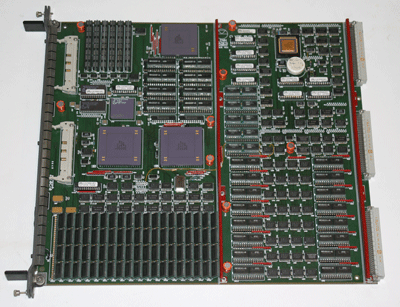
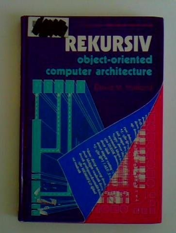
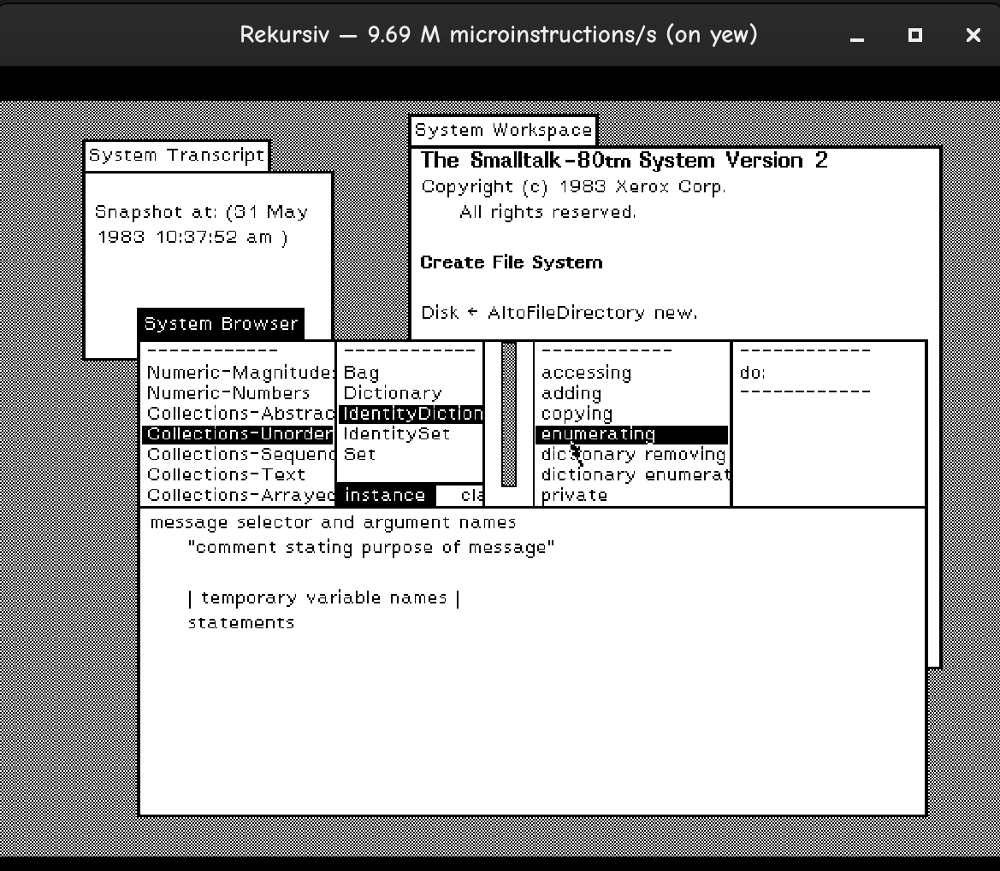

# Rekursiv

An attempt to build David Harland’s 1980s **Rekursiv** hardware object-oriented machine in
synthesizable SystemVerilog, with extensions.

[Rekursiv](https://en.wikipedia.org/wiki/Rekursiv) came from Linn Smart Computing, a division of the
Scottish hi-fi manufacturer Linn Products. Linn wanted better software to run its factory. Its
experiments with LINGO, a language related to Smalltalk, led to an unusual next step: building a
processor for object-oriented programs. Harland and his colleagues developed a custom chipset and
the HADES board, which plugged into a Sun workstation.



_Original hardware. Photo from the
[Jim Austin Computer Collection](https://www.computermuseum.org.uk/fixed_pages/rekursiv1.html)._

The idea was to put object management into the machine itself. Programs used stable object
identities, while hardware and microcode handled object lookup, checked field access, allocation,
paging, and garbage collection. Objects could move without changing references to them. The
architecture treated RAM and disk as a persistent object store, so objects could outlive the
programs that created them. Programmers could define language-specific instruction sets in
microcode, including recursive routines.

Only a small number of boards reached users before Linn shut the project down.
[James Lothian’s 1993 recollection](https://groups.google.com/g/comp.arch/c/Rb08QH5Jsl0/m/QuwXBHQgF5kJ)
describes the architecture, the commercial troubles, and life as a Rekursiv programmer. It also
recounts the infamous collision between a Linn van and Harland’s Porsche, and the dispute over
repairs that followed.

<a href="https://openlibrary.org/books/OL2044584M/REKURSIV"></a>

The starting point is Harland’s
[_Rekursiv: Object-Oriented Computer Architecture_](https://openlibrary.org/books/OL2044584M/REKURSIV)
(Ellis Horwood, 1988).

## The machine

The implementation follows the three main parts of the Rekursiv architecture:

- **OBJEKT** manages object identities, resident metadata, field access, allocation, and transfers
  between object memory and backing storage.
- **LOGIK** executes microcode and controls instruction dispatch, branches, calls, and stacks.
- **NUMERIK** provides the integer arithmetic unit, registers, and arithmetic flags.

This version uses a **40-bit object representation**, with tagged object references and compact
values. It defines its own control-word encodings and memory handshakes. Object memory is intended
to use external SRAM or DRAM.

Historical binary compatibility is not a goal. We have no original software images to target, and it
is unclear whether any usable copies survive. Perhaps there is a backup at the bottom of the
[Forth and Clyde canal](https://en.wikipedia.org/wiki/Rekursiv#History).

The first language implementation is **Smalltalk-80**, in place of the original machine’s LINGO.
Language-specific object layouts, method lookup, and bytecode execution live in microcode.
The lower-level hardware remains independent of Smalltalk.

The machine currently runs **Smalltalk-80** from a converted Xerox image, with a graphical desktop,
keyboard, and mouse. The "Blue Book" was used as a reference to write the microcode which ultimately
executes on the emulated Rekursiv hardware.

The Smalltalk desktop is tested only in the native software emulator. FPGA board integration remains unfinished.



_Smalltalk-80 running on Rekursiv microcode in the native emulator._


Ultimate success means running this Smalltalk-80 workstation on my Mellanox NV303212A FPGA
card. It will have the card’s obscene 8 GB of RAM to play with. Display output will use the PCIe
host machine’s framebuffer to make pretty pictures.

## Implementation

The processor executes standalone microcode programs with integer arithmetic, stacks, object
allocation, checked access, writeback, and automatic refill. RAM garbage collection runs in LOGIK
microcode with OBJEKT hardware support. It traces objects, copies their bodies between two memory
regions, restores the interrupted program, and retries the allocation or refill.

The repository includes a text microassembler, a native Rust emulator with display, keyboard, and
mouse, and a Verilator simulator. A Rust architectural model checks the hardware's results.
The simulation harness supplies external memory and backing storage. The allocation and collection examples execute their program control flow and garbage
collection on the RTL processor.

The Smalltalk microcode executes bytecodes, runtime primitives, and process scheduling. NUMERIK
supports integer and binary32 arithmetic. BitBlt runs in microcode and refreshes the display
as the original Smalltalk image draws its desktop.
Disk transfers, snapshot saving, and FPGA board integration remain unfinished.
The RTL passes generic synthesis checks. It has not yet been validated on an FPGA board.

## Build and run

Fetch the Xerox Smalltalk-80 image and run it in the native emulator:

```sh
python3 scripts/fetch-smalltalk-image.py
cargo run --release --locked -p rekursiv-emulator -- \
  --smalltalk artifacts/st80/VirtualImage --memory-words 16777216
```

For the standalone display and input demo:

```sh
cargo run --release --locked -p rekursiv-emulator
```

Move the mouse or press a key to exercise the peripheral microcode. Close the window to exit.
The [emulator guide](docs/emulator.md) covers build dependencies, headless execution, traces, and the Smalltalk image.
This executable does not require Verilator or Yosys.

For RTL simulation and synthesis, install Rust with `rustfmt` and `clippy`, Verilator, Yosys,
a C++ compiler, and Make. On Debian or Ubuntu, install the hardware tools with:

```sh
sudo apt-get install verilator yosys clang build-essential
```

Run a microcode program that allocates objects and triggers garbage collection:

```sh
cargo run --locked -p rekursiv-sim -- --microcode microcode/collection.uc
```

Run the allocation, eviction, and refill example with a listing and waveform:

```sh
cargo run --locked -p rekursiv-sim -- \
  --microcode microcode/allocation.uc --listing --trace-file allocation.vcd
```

Open the VCD file in a waveform viewer such as GTKWave. The [assembler guide](docs/assembler.md)
describes the source syntax, labels, control fields, and image directives. The programs in
[microcode/](microcode/) include both examples and the RAM collector.

Run all examples, including the individual object-memory demonstrations:

```sh
cargo run --locked -p rekursiv-sim -- --example all
```

Use `--list` for example names and `--help` for simulator options, including memory delays and
response stalls. The simulator reports an error if the hardware disagrees with the reference model
or an example assertion fails.

## Development

Hardware lives in [rtl/](rtl/). The Rust workspace contains the [assembler](crates/rekursiv-asm/),
[architectural model](crates/rekursiv-model/), [native emulator](crates/rekursiv-emulator/),
[shared peripherals](crates/rekursiv-devices/), and [RTL simulator](crates/rekursiv-sim/). The
[interface reference](docs/interface.md) documents object commands, encodings, and memory
handshakes.

Run formatting checks, Clippy, tests, RTL lint, synthesis, and the examples with:

```sh
scripts/check.sh
```
